# 🧪 Wazuh Lab Walkthrough — Complete Hands-On Guide# 🧪 Wazuh Dashboard Lab Walkthrough — Complete Hands-On Guide


> **Lab Environment:** Wazuh All-in-One (Single Node) deployed on AWS EC2 (Ubuntu)> **Lab Environment:** Wazuh All-in-One (Single Node) Deployment

> **Purpose:** Install Wazuh, enroll agents, and explore every section of the Wazuh Dashboard.> **Purpose:** Explore every section of the Wazuh Dashboard, understand what each module does, and learn how to navigate as a SOC Analyst / DevOps Engineer.

> **Cloud Provider:** AWS (2 × EC2 instances — 1 Wazuh Server + Agents)

---

---

## 📌 What This Lab Covers

## 📌 What This Lab Covers

In this lab, we installed Wazuh on a single node, enrolled agents, configured `ossec.conf` to enable key security modules, and then explored **every major section** of the Wazuh Dashboard. Below is a walkthrough of each step with screenshots.

1. SSH into an AWS EC2 Ubuntu instance

2. Install Wazuh using the quickstart script---

3. Access the Wazuh Dashboard for the first time

4. Explore all Dashboard modules (Endpoint Security, IT Hygiene, MITRE ATT&CK, etc.)---

5. Open AWS Security Group to allow agent communication (port 1514/1515)

6. Deploy a second EC2 instance and enroll it as a Wazuh Agent## 🖥️ Step 1 — Wazuh Dashboard Login & Overview

7. Explore Vulnerability Detection, Configuration Assessment (SCA), and more

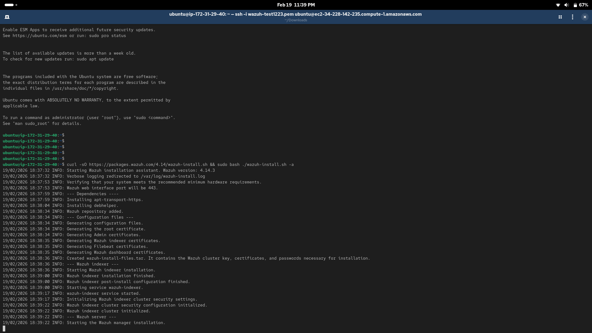

---

### What We're Seeing

---When you first access the Wazuh Dashboard (via `https://<your-ip>:443`), you land on the **Overview** page. This is your **security command center** — a bird's-eye view of your entire monitored environment.


## Step 1 — SSH into the Ubuntu EC2 Instance### Key Things on the Overview Page


| Element | What It Shows |

|---|---|

### What's Happening Here| **Total Agents** | How many agents are enrolled (active, disconnected, never connected) |

| **Security Events** | Total number of security events over the selected time range |

We are **SSH-ing into our AWS EC2 Ubuntu instance** for the first time. This is the server where we will install Wazuh (all-in-one deployment).| **Alert Level Distribution** | Breakdown of alerts by severity (low, medium, high, critical) |

| **Top MITRE ATT&CK Tactics** | Most common attack techniques detected |

You can see the typical Ubuntu SSH welcome message:| **Top 5 Agents** | Agents generating the most alerts |

| **Top 5 Rules** | Most frequently triggered detection rules |

- `Enable ESM Apps to receive additional future security updates`

- `Ubuntu comes with ABSOLUTELY NO WARRANTY`> 💡 *"The overview tab is self-explanatory, yet... Dashboards are for visibility, not for in-depth investigation."* — SOC 201 Podcast

- System info like uptime, packages, etc.

---

### Why This Step

## 📊 Step 2 — Security Events Overview

Before installing anything, we need terminal access to the server. We used:

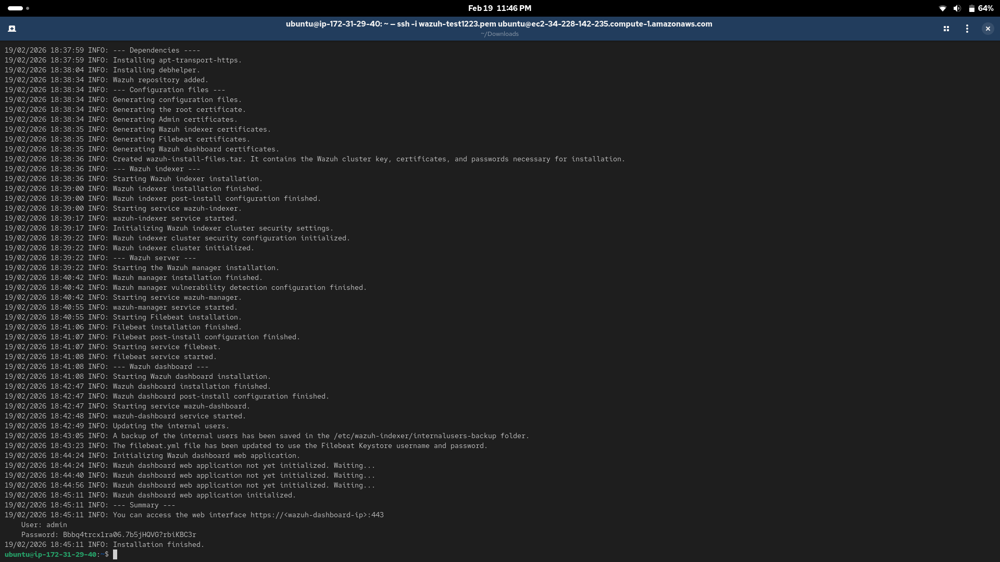

```bash

ssh -i "your-key.pem" ubuntu@<ec2-public-ip>### What We're Seeing

```The security events timeline and distribution. This shows the **volume and pattern** of alerts over time.


This is our **Wazuh Server** — it will run the Wazuh Manager, Indexer, and Dashboard (all-in-one single node).### Why This Matters

- **Spikes** in the timeline = something happened (attack, misconfiguration, new agent online)

---- **Flat lines** at zero = either nothing is happening (good) or your detection isn't working (bad!)

- Use the **time picker** (top right) to zoom into specific time ranges

## Step 2 — Running the Wazuh Installation Script

### SOC Analyst Workflow

```

1. Look at the timeline → Any unusual spikes?

### What's Happening Here2. Check alert levels → How many high/critical?

3. Check top agents → Which machines are noisiest?

We are running the **Wazuh quickstart installation script**. The terminal shows the installation progress:4. Check top rules → What's being detected most?

5. Drill into specifics → Click to investigate

- `INFO: --- Dependencies ---` — Installing required packages (`apt-transport-https`, `debhelper`)```

- `INFO: Wazuh repository added` — Wazuh package repo is now configured

- `INFO: --- Configuration files ---` — Generating config files---

- `INFO: Generating the root certificate` — Creating TLS/SSL certificates

- `INFO: Generating Admin certificates` — Admin certs for dashboard access## 🔌 Step 3 — Agents Overview

- `INFO: Generating Wazuh indexer certificates` — Certs for indexer communication

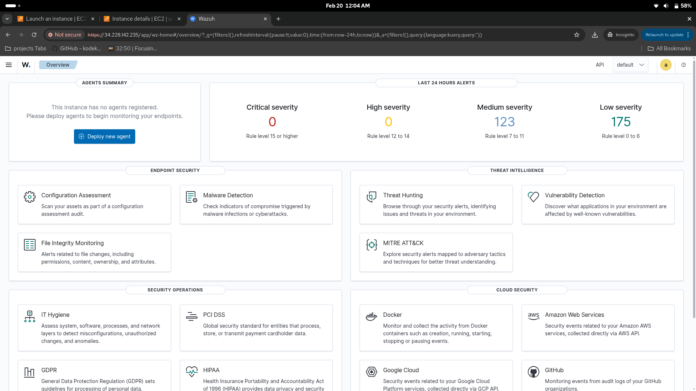

### Commands Used

### What We're Seeing

```bashThe **Agents** section shows all enrolled Wazuh agents with their status, OS, IP address, and agent version.

curl -sO https://packages.wazuh.com/4.x/wazuh-install.sh

sudo bash ./wazuh-install.sh -a### Agent Statuses

```

| Status | Color | Meaning |

The `-a` flag means **all-in-one** — it installs the Wazuh Manager, Indexer, and Dashboard on the same machine.|---|---|---|

| **Active** | 🟢 Green | Agent is connected and sending data |

### What Gets Installed| **Disconnected** | 🔴 Red | Agent was connected but lost connection |

| **Never Connected** | ⚫ Grey | Agent was enrolled but never established a connection |

| Component | What It Does || **Pending** | 🟡 Yellow | Agent is waiting for enrollment |

|---|---|

| **Wazuh Manager** | Receives and analyzes events from agents |### What You Can Do Here

| **Wazuh Indexer** | Stores alerts as searchable JSON documents |- Click on any agent to see its **detailed view** (events, inventory, config)

| **Wazuh Dashboard** | Web UI for visualization (port 443) |- Filter agents by **OS, status, group**

- See agent **version** (check if any agents need upgrading)

> ⚠️ After installation completes, it prints the **admin password**. Save it — you need it to log in!- Check **last keep-alive** time (when did the agent last check in?)


------


## Step 3 — Wazuh Dashboard: First Login (No Agents Yet)## 🖥️ Step 4 — Individual Agent Dashboard


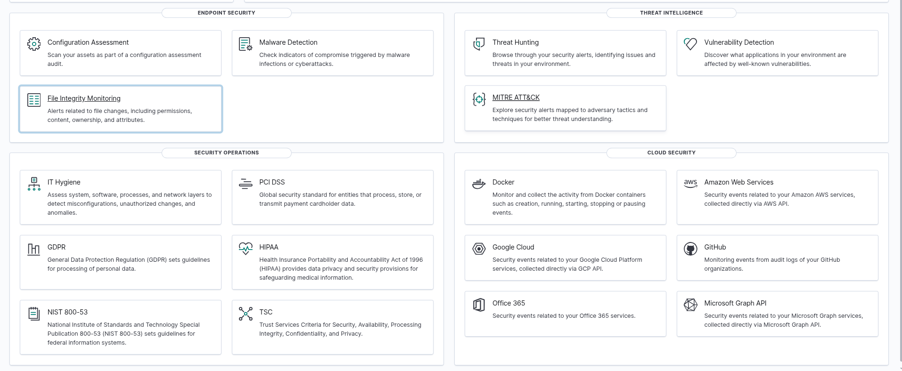


### What's Happening Here### What We're Seeing

When you click on a specific agent, you get its **dedicated dashboard** — everything about that one endpoint.

We've opened the Wazuh Dashboard in the browser at `https://<ec2-public-ip>:443` and logged in with the admin credentials.

### Sections Available Per Agent

This is the **Overview page** — but notice the message:

| Section | What It Shows |

> **"This instance has no agents registered. Please deploy agents to begin monitoring your endpoints."**|---|---|

| **Overview** | Summary of events, alert levels, top rules for this agent |

### What We See| **Configuration** | Current agent configuration (which modules are enabled) |

| **Inventory** | OS, packages, processes, ports, network interfaces |

| Element | Status || **SCA** | Security Configuration Assessment results for this agent |

|---|---|| **FIM** | File Integrity Monitoring events on this agent |

| **Agents Summary** | 0 agents — none registered yet || **Vulnerabilities** | Known CVEs affecting this specific agent |

| **Critical severity** | Rule level 15 or higher — no events yet |

| **Endpoint Security modules** | Listed but empty (no data without agents) |---


### Why It's Empty## ✅ Step 5 — Configuration Assessment (SCA)


The Wazuh Dashboard shows data **only from enrolled agents**. Since we just installed the server and haven't deployed any agents yet, everything is at zero. This is expected.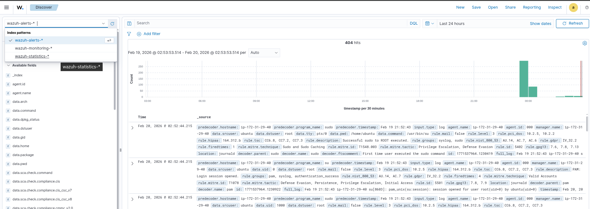


---### What We're Seeing

The **Security Configuration Assessment** module showing CIS benchmark scan results.

## Step 4 — Dashboard Modules Overview (Sidebar)

### What You See


| Column | Description |

### What's Happening Here|---|---|

| **Policy** | The benchmark being checked (e.g., CIS Ubuntu 22.04) |

We're exploring the **left sidebar / modules panel** of the Wazuh Dashboard. This shows all available security modules organized by category:| **Score** | Compliance percentage (higher is better) |

| **Passed** | Number of checks that passed |

**Endpoint Security:**| **Failed** | Number of checks that failed (these need fixing!) |

| **Not Applicable** | Checks that don't apply to this system |

| Module | Description |

|---|---|### How to Read It

| **Configuration Assessment** | Scan your assets as part of a configuration assessment audit (CIS benchmarks) |- **Score 39%** = Only 39% of CIS checks pass. Your system needs hardening.

| **File Integrity Monitoring** | Alerts related to file changes — permissions, content, ownership, and attributes |- Click on **Failed** checks to see exactly what's wrong and how to fix it.

| **Malware Detection** | Check indicators of compromise triggered by malware infections or cyberattacks |- Each failed check includes **Remediation** steps.


**Security Operations:**> This module is powered by `<sca><enabled>yes</enabled></sca>` in `ossec.conf`.


| Module | Description |---

|---|---|

| **IT Hygiene** | Assess system, software, processes, and network layers |## ✅ Step 6 — SCA Policy Details

| And more... | PCI DSS, GDPR, HIPAA, NIST, TSC compliance modules |

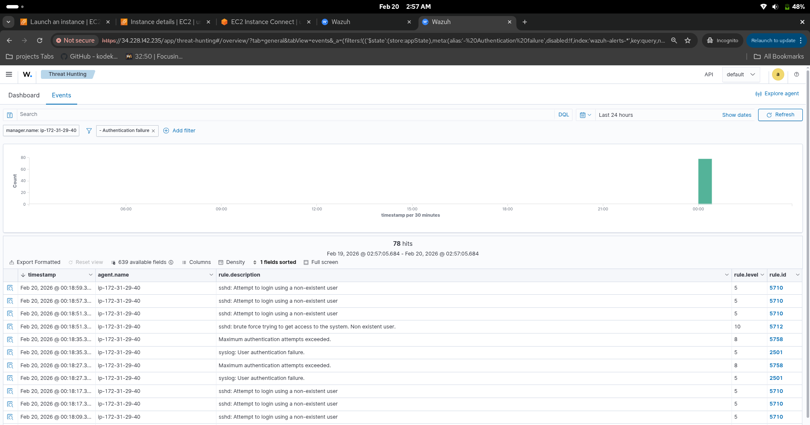

> 💡 These modules will remain empty until we deploy agents and enable the corresponding sections in `ossec.conf`.

### What We're Seeing

---Drilling into a specific SCA policy to see **individual check results**.


## Step 5 — Discover Tab: Wazuh Alerts Index Pattern### Check Result Details


| Field | What It Shows |

|---|---|

### What's Happening Here| **ID** | Unique check identifier (e.g., 28500) |

| **Title** | What's being checked (e.g., "Ensure /tmp is a separate partition") |

We're in the **Discover** tab (similar to OpenSearch/Kibana Discover). This is the raw data explorer.| **Status** | Pass ✅ / Fail ❌ / Not Applicable ⬜ |

| **Rationale** | Why this check matters for security |

### Key Elements Visible| **Remediation** | Step-by-step instructions to fix the issue |

| **Compliance** | Which standards this maps to (CIS, PCI DSS, HIPAA, etc.) |

| Element | What It Shows |

|---|---|> 💡 **Pro Tip:** Sort by **Failed** first. These are your actionable items. Fix the easy ones first to quickly improve your score.

| **Index patterns** | `wazuh-alerts-*`, `wazuh-monitoring-*`, `wazuh-statistics-*` |

| **Search bar** | DQL (Dashboard Query Language) for searching alerts |---

| **Time range** | `Last 24 hours` with date picker |

| **Hits** | `404 hits` — total matching documents in this time window |## 🦠 Step 7 — Malware Detection Module

| **Available fields** | Fields like `index` that you can add as columns |

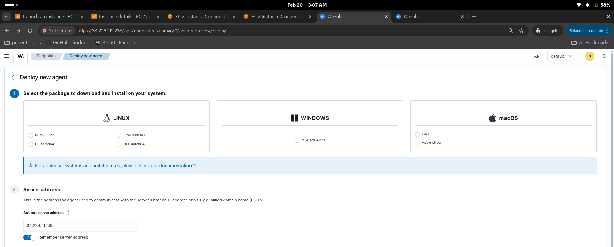

### What Are These Index Patterns?

### What We're Seeing

| Index Pattern | What It Stores |The **Malware Detection** module showing alerts related to malware activity, rootkits, and IOCs.

|---|---|

| `wazuh-alerts-*` | All security alerts generated by rules |### Types of Alerts You'll See Here

| `wazuh-monitoring-*` | Agent connection/status monitoring data |

| `wazuh-statistics-*` | Performance and statistics data || Alert Type | Description |

|---|---|

This is where SOC analysts do their **raw investigation** — searching through alerts, filtering by fields, and exporting data.| **Rootkit detection** | Known rootkit files or behaviors found |

| **Trojaned binary** | System binary replaced with malicious version |

---| **Hidden process** | Process running but invisible to `ps` |

| **Hidden port** | Network port open but invisible to `netstat` |

## Step 6 — Threat Hunting: Authentication Failure Events| **Suspicious file** | Executable dropped in commonly abused directories |

| **Threat intelligence match** | File hash/IP matches known malware database |


> This module is powered by `<rootcheck><disabled>no</disabled></rootcheck>` in `ossec.conf`.

### What's Happening Here

---

We're in the **Threat Hunting** module, filtered to show **Authentication failure** events.

## 📁 Step 8 — File Integrity Monitoring (FIM)

### Key Elements Visible

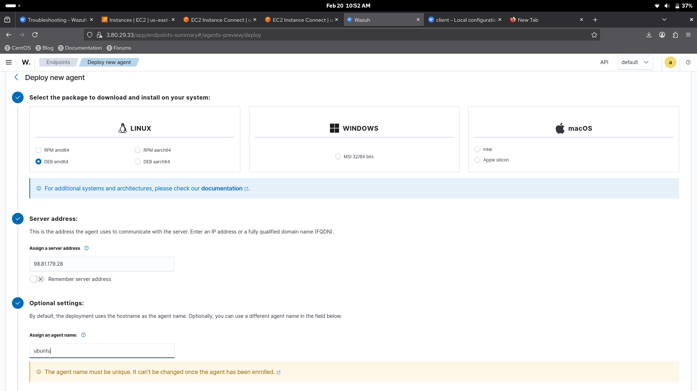

| Element | What It Shows |

|---|---|### What We're Seeing

| **Module** | Threat Hunting |The **File Integrity Monitoring** module showing file change events across monitored endpoints.

| **Filter applied** | `Authentication failure` |

| **Manager name** | `ip-172-31-28-40` (our Wazuh server) |### What FIM Tracks

| **Time range** | Last 24 hours |

| **Dashboard + Events tabs** | Dashboard shows charts, Events shows raw logs || Event Type | Icon | Description |

| **Count** | Number of authentication failure events detected ||---|---|---|

| **Added** | ➕ | New file was created |

### Why Authentication Failures Matter| **Modified** | ✏️ | Existing file was changed |

| **Deleted** | 🗑️ | File was removed |

These events indicate someone (or something) tried to log in and **failed**. This could mean:

### Dashboard Elements

- **Brute force attacks** — someone trying many passwords- **Events over time** — Timeline of file changes

- **Misconfigured services** — wrong credentials in automation- **Top agents** — Which endpoints have the most file changes

- **Unauthorized access attempts** — someone trying to break in- **Top files** — Most frequently modified files

- **Actions summary** — Count of added/modified/deleted

> This is one of the most common alert types in Wazuh. In a real SOC, you'd investigate the **source IP**, check how many attempts there were, and potentially block the attacker using Active Response.

> This module is powered by `<syscheck><disabled>no</disabled></syscheck>` in `ossec.conf`.

---

---

## Step 7 — Deploy New Agent: OS Selection

## 📁 Step 9 — FIM Event Details


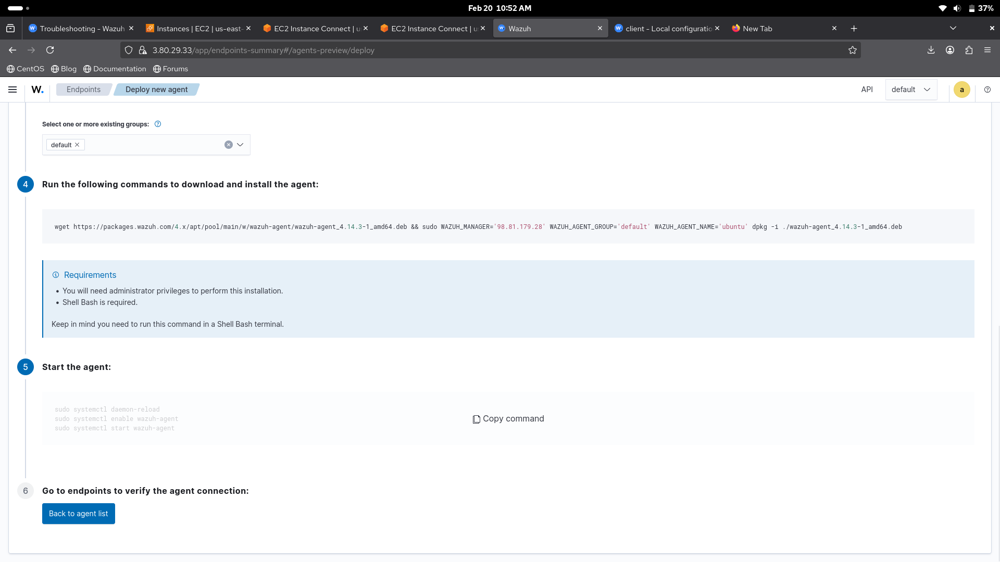

### What's Happening Here

### What We're Seeing

We're deploying our **first Wazuh Agent**. The Dashboard provides a built-in agent deployment wizard.Drilling into a specific FIM event to see **exactly what changed**.


### Step 1: Select the Operating System### Event Detail Fields


The wizard shows three options:| Field | What It Shows |

|---|---|

| OS | Package Types || **File path** | `/etc/passwd`, `/etc/shadow`, etc. |

|---|---|| **Event type** | Modified / Added / Deleted |

| **LINUX** | RPM (amd64), RPM (aarch64), DEB (amd64), DEB (aarch64) || **Changed attributes** | Which attributes changed (content, permissions, owner, etc.) |

| **WINDOWS** | MSI (32/64 bits) || **Old value → New value** | What the attribute was before and after |

| **macOS** | Intel, Apple Silicon || **User** | Who made the change |

| **Process** | Which process made the change |

Since our second EC2 instance runs **Ubuntu (Debian-based)**, we select **LINUX → DEB amd64**.| **Timestamp** | Exactly when the change occurred |

| **MD5 / SHA1 / SHA256** | File hash before and after (proves content changed) |

---

> 💡 **This answers the 5 WH questions:** WHO changed it, WHAT was changed, WHERE (file path), WHEN (timestamp), and HOW (which process).

## Step 8 — Deploy New Agent: Package Selection

---


## 🔎 Step 10 — Threat Hunting Module

### What's Happening Here

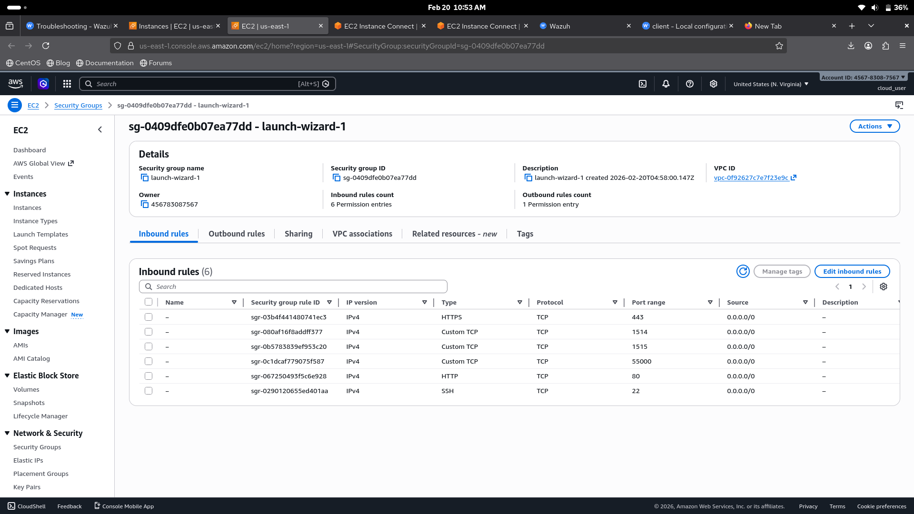

Continuing the agent deployment wizard — we've selected **Linux** and now we're choosing the specific package type:

### What We're Seeing

- **RPM amd64** — For Red Hat, CentOS, Amazon Linux, FedoraThe **Threat Hunting** module — the SOC analyst's primary investigation workspace.

- **RPM aarch64** — For ARM-based Linux (Graviton)

- **DEB amd64** — For Ubuntu, Debian ✅ (this is what we need)### How to Use Threat Hunting

- **DEB aarch64** — For ARM-based Ubuntu/DebianThis is a **raw alert explorer** with powerful search and filtering:


We select **DEB amd64** since our second EC2 instance is Ubuntu on x86_64.| Feature | How to Use It |

|---|---|

---| **Search bar** | Type any keyword — IP, username, rule ID, file path |

| **Time range** | Use the date picker to narrow down to a specific window |

## Step 9 — Deploy New Agent: Installation Command| **Filters** | Add filters for agent, rule level, rule group, MITRE technique |

| **Columns** | Customize which columns are shown in the results table |

| **Alert details** | Click any row to expand the full JSON alert |


### What's Happening Here### SOC Investigation Flow

```

The wizard generates the **exact command** to run on the agent machine. We can see:1. Start with a time range (when did the incident happen?)

2. Filter by alert level ≥ 10 (focus on high severity)

```bash3. Search for the IOC (IP, hash, domain, username)

wget https://packages.wazuh.com/4.x/apt/pool/main/w/wazuh-agent/wazuh-agent_4.14.3-1_amd64.deb && \4. Expand alerts to read full context

sudo WAZUH_MANAGER='98.81.179.28' \5. Correlate — are multiple agents affected?

     WAZUH_AGENT_GROUP='default' \6. Document findings for the incident report

     WAZUH_AGENT_NAME='ubuntu' \```

     dpkg -i ./wazuh-agent_4.14.3-1_amd64.deb

```---


### Breaking Down the Command## 🔎 Step 11 — Threat Hunting: Alert Details


| Part | What It Does |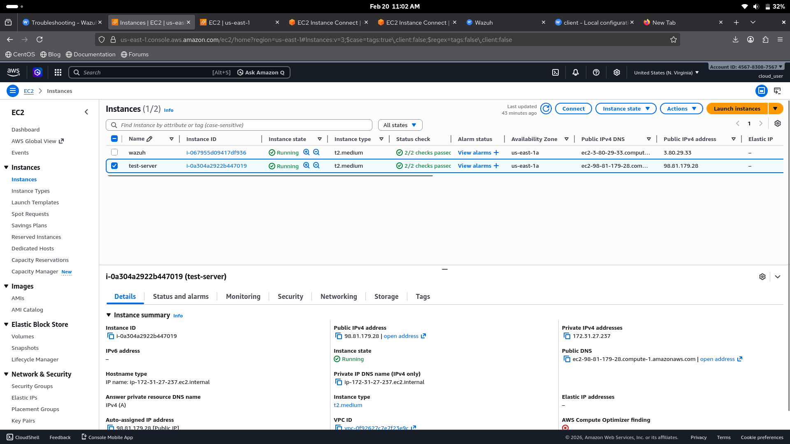

|---|---|

| `wget ...wazuh-agent_4.14.3-1_amd64.deb` | Downloads the Wazuh Agent package |### What We're Seeing

| `WAZUH_MANAGER='98.81.179.28'` | Sets the Wazuh Server IP (our EC2 public IP) |Expanding a specific alert in the Threat Hunting module to see its **full JSON payload**.

| `WAZUH_AGENT_GROUP='default'` | Assigns the agent to the `default` group |

| `WAZUH_AGENT_NAME='ubuntu'` | Names this agent "ubuntu" |### What the JSON Contains

| `dpkg -i ./wazuh-agent...deb` | Installs the downloaded package |

```json

### Configuration Visible{

  "agent": { "id": "001", "name": "ubuntu-server", "ip": "10.0.1.50" },

- **Server address:** `98.81.179.28` (the Wazuh manager's public IP)  "rule": {

- **Group:** `default`    "id": "5710",

- **Agent name:** Can be customized    "level": 10,

    "description": "SSH brute-force attack",

> ⚠️ **Important:** For the agent to connect, port **1514** and **1515** must be open on the Wazuh Server's Security Group. That's what we do next!    "mitre": { "id": ["T1110"], "tactic": ["Credential Access"] },

    "pci_dss": ["10.2.4"],

---    "gdpr": ["IV_35.7.d"]

  },

## Step 10 — AWS Security Group: Inbound Rules  "data": {

    "srcip": "192.168.1.100",

    "dstuser": "root"

  },

### What's Happening Here  "full_log": "sshd[12345]: Failed password for root from 192.168.1.100..."

}

We're in the **AWS EC2 Console → Security Groups** section. This is the firewall configuration for our Wazuh Server EC2 instance.```


### Security Group Details> Every field is searchable. Every field can be used as a filter. This is the power of Wazuh + Indexer.


| Field | Value |---

|---|---|

| **Security Group Name** | `launch-wizard-1` |## 💀 Step 12 — Vulnerability Detection Overview

| **Security Group ID** | `sg-0409dfe0b07ea77dd` |

| **VPC ID** | `vpc-0f92627c7e7f23e9c` |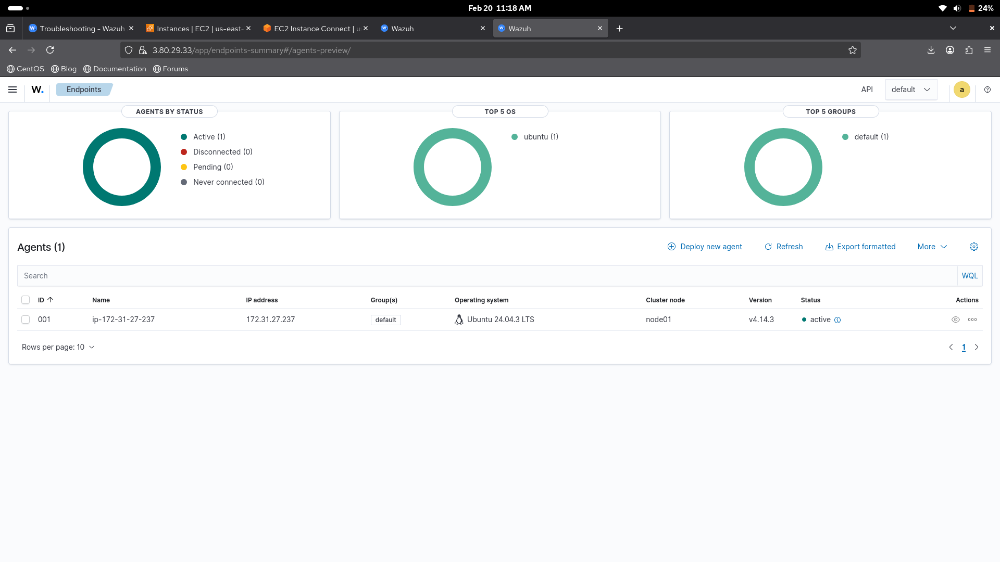

| **Inbound Rules Count** | 6 permission entries |

| **Outbound Rules Count** | 1 permission entry |### What We're Seeing

The **Vulnerability Detection** module showing known CVEs across all monitored endpoints.

### Why This Is Critical

### Dashboard Elements

For the Wazuh Agent to connect to the Wazuh Server, the following ports **must be open** in the inbound rules:

| Element | What It Shows |

| Port | Protocol | Purpose ||---|---|

|---|---|---|| **Total vulnerabilities** | Count across all agents |

| **1514** | TCP | Agent event data transmission || **Severity chart** | Critical / High / Medium / Low breakdown |

| **1515** | TCP | Agent enrollment/registration || **Top vulnerable agents** | Which endpoints need patching first |

| **443** | TCP | Dashboard web access (HTTPS) || **Top CVEs** | Most common vulnerabilities |

| **22** | TCP | SSH access || **Vulnerability table** | Detailed list with CVE ID, package, severity, agent |


> If you skip this step, the agent will fail to connect with a "Connection refused" error. This is the **#1 most common issue** when deploying agents on AWS.> This module is powered by `<vulnerability-detection><enabled>yes</enabled></vulnerability-detection>` in `ossec.conf` and requires `<syscollector>` to be enabled.


------


## Step 11 — AWS EC2: Two Instances Running## 💀 Step 13 — Vulnerability Alert Details


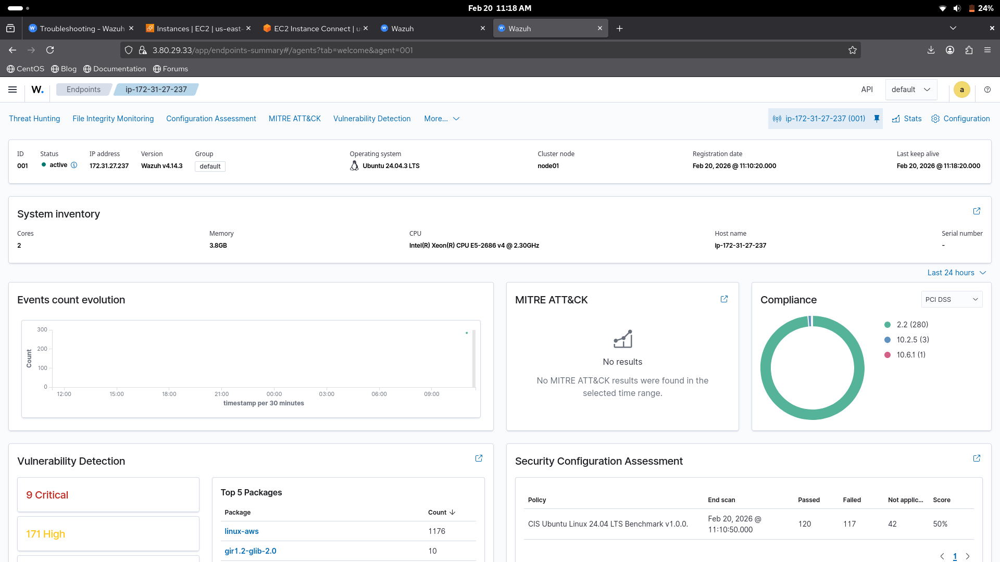


### What's Happening Here### What We're Seeing

Drilling into a specific vulnerability to see its **full details**.

We're in the **AWS EC2 Instances** dashboard. We can see **2 instances** running:

### Vulnerability Detail Fields

| Instance | Role |

|---|---|| Field | Example |

| **Instance 1** | Wazuh Server (Manager + Indexer + Dashboard) ||---|---|

| **Instance 2** | Wazuh Agent (the endpoint we're monitoring) || **CVE** | CVE-2024-1234 |

| **Severity** | Critical (CVSS 9.8) |

### Columns Visible| **Package** | openssl 3.0.2-0ubuntu1 |

| **Status** | Active / Fixed |

| Column | What It Shows || **Description** | Buffer overflow allowing remote code execution... |

|---|---|| **References** | Links to NVD, vendor advisories |

| **Name** | Instance name tag || **Remediation** | Upgrade to version X.Y.Z |

| **Instance State** | Running / Stopped || **Affected agent** | web-server-01 |

| **Instance Type** | Machine size (t2.medium, t3.large, etc.) |

| **Status Check** | Health check status |---

| **Availability Zone** | `us-east-1` (N. Virginia) |

| **Public IPv4 DNS** | Public address to connect |## ⚔️ Step 14 — MITRE ATT&CK Module


> 💡 This is our lab setup: **2 EC2 instances** in the same VPC. One runs Wazuh all-in-one, the other runs the Wazuh Agent.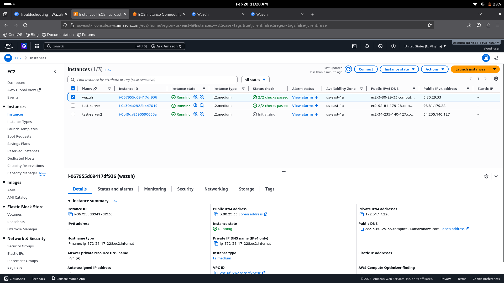


---### What We're Seeing

The **MITRE ATT&CK** module showing security events mapped to adversary tactics and techniques.

## Step 12 — Wazuh Dashboard: First Agent Enrolled

### What the MITRE View Shows


| Element | Description |

### What's Happening Here|---|---|

| **Tactics bar chart** | Which of the 14 ATT&CK tactics have been observed |

Back in the Wazuh Dashboard → **Endpoints** section. Now we can see our **first agent has enrolled successfully!**| **Techniques table** | Specific techniques with alert counts |

| **Heatmap** | Visual representation of technique frequency |

### Agent Details

### Reading the MITRE Dashboard

| Field | Value |- **Most common tactics** = where your environment is being targeted most

|---|---|- **Rare tactics** = either you're not being targeted OR your detection has gaps

| **Agent ID** | `001` |- Click any technique to see the **specific alerts** that triggered it

| **Name** | `ip-172-31-27-237` |

| **Status** | 🟢 Active |---

| **Count** | 1 agent total |

## ⚔️ Step 15 — MITRE ATT&CK Technique Details

### What Changed

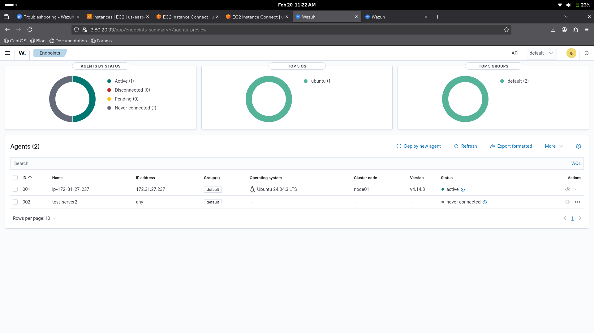

Earlier in Step 3, the dashboard said "No agents registered." Now after:

1. Opening the Security Group ports (Step 10)### What We're Seeing

2. Running the install command on the second EC2 (Step 9)Drilling into a specific MITRE ATT&CK technique to see which **alerts and agents** are associated.

3. Starting the agent service (`sudo systemctl start wazuh-agent`)

### Why This Matters

...the agent connected and appears as **Active** ✅Instead of seeing isolated alerts, you now see them in the **context of an attack chain**:

```

---T1110 (Brute Force) → Multiple failed SSH logins from same IP

T1078 (Valid Accounts) → Successful login after brute force

## Step 13 — Individual Agent DashboardT1059 (Command Execution) → Suspicious commands run post-login

T1547 (Persistence) → New startup script created

```


### What's Happening Here> 💡 This turns random alerts into a **coherent attack narrative**.


We clicked on agent `001` to view its **individual dashboard**. This shows everything about this specific endpoint.---


### Agent Information## 🔧 Step 16 — IT Hygiene / System Inventory


| Field | Value |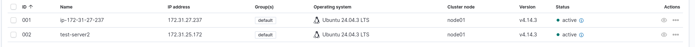

|---|---|

| **ID** | 001 |### What We're Seeing

| **Status** | 🟢 Active |The **IT Hygiene** module (also known as System Inventory) showing the state of your endpoints.

| **IP Address** | 172.31.27.237 |

| **Version** | Wazuh v4.14.3 |### Inventory Categories

| **Group** | default |

| **Operating System** | Ubuntu 24.04.3 LTS || Category | What It Shows |

| **Cluster Node** | node01 ||---|---|

| **Registration Date** | Feb 20, 2026 @ 11:10:20 || **Packages** | All installed software with versions |

| **Processes** | Currently running processes |

### Available Tabs for This Agent| **Ports** | Open/listening ports and associated services |

| **Network** | Network interfaces, IPs, MACs |

| Tab | What It Shows || **OS** | Operating system name, version, kernel |

|---|---|| **Hardware** | CPU, RAM, serial numbers |

| **Threat Hunting** | Security alerts for this agent |

| **File Integrity Monitoring** | File change events on this agent |> This data is collected by `<wodle name="syscollector">` in `ossec.conf`.

| **Configuration Assessment** | SCA/CIS benchmark results |

| **MITRE ATT&CK** | ATT&CK technique mappings |---

| **Vulnerability Detection** | CVEs found on this agent |

| **Stats** | Agent performance statistics |## 📦 Step 17 — System Inventory: Packages

| **Configuration** | Current agent configuration |

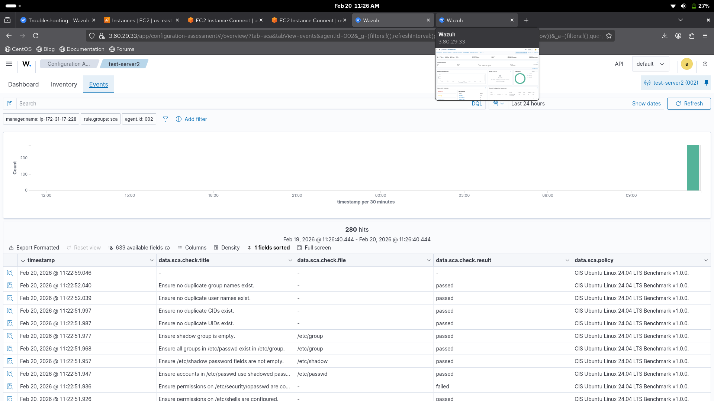

---

### What We're Seeing

## Step 14 — AWS EC2: Managing InstancesThe **Packages** view within IT Hygiene — every installed package on the selected agent.


### Why This Is Useful

- **Find vulnerable software:** Search for a specific package name/version

### What's Happening Here- **Shadow IT:** Detect unauthorized software installations

- **Compliance:** Verify only approved software is installed

We're back in the **AWS EC2 Console**, preparing to launch or manage our second EC2 instance (for the second Wazuh Agent).- **Patch management:** Compare versions across agents


### EC2 Sidebar Sections Visible---


| Section | Purpose |## 🌐 Step 18 — System Inventory: Network / Ports

|---|---|

| **Dashboard** | EC2 overview |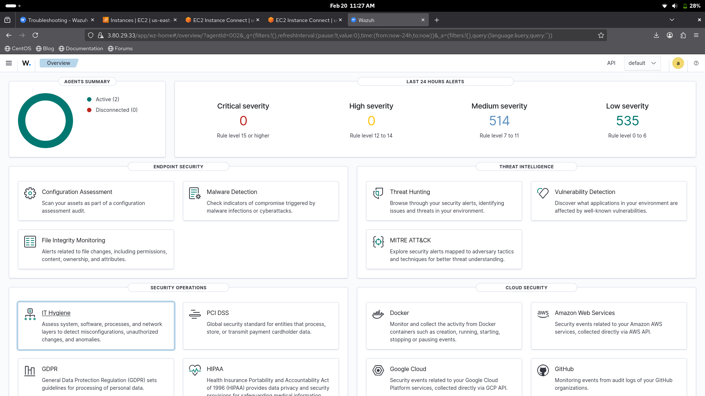

| **Instances** | Running instances |

| **Instance Types** | Available machine types |### What We're Seeing

| **Launch Templates** | Saved instance configurations |The **Network interfaces and open ports** view.

| **Spot Requests** | Spot instance management |

| **Savings Plans** | Cost optimization |### Key Things to Look For

| **Reserved Instances** | Long-term reservations |

| **Dedicated Hosts** | Dedicated hardware || Red Flag | What It Means |

| **Capacity Reservations** | Reserved capacity ||---|---|

| **Unexpected open port** | A service is running that shouldn't be (backdoor?) |

> We're launching a second instance to demonstrate monitoring **multiple agents** in Wazuh.| **Port 0.0.0.0:XXXX** | Service listening on ALL interfaces (should it be?) |

| **Unknown process on a port** | Unfamiliar process bound to a network port |

---| **New interface** | New network interface appeared (VM escape? tunnel?) |


## Step 15 — Wazuh Dashboard: Two Agents Enrolled---


## 💳 Step 19 — PCI DSS Compliance Module


### What's Happening Here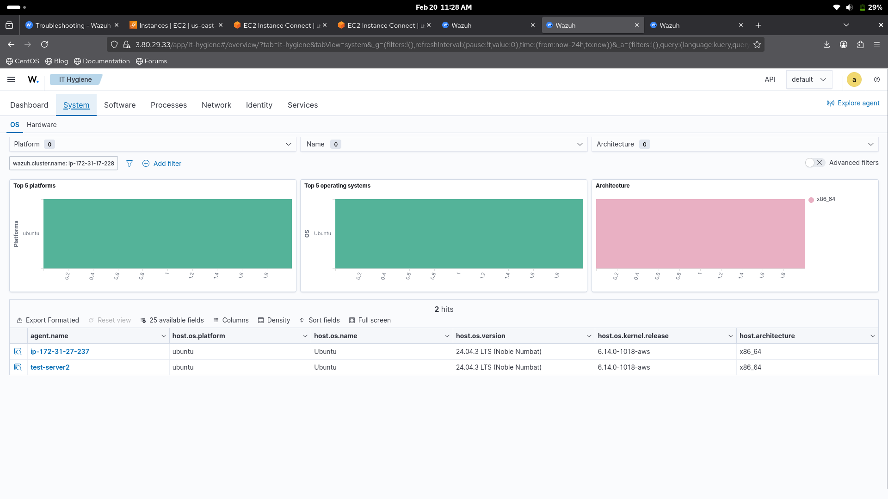


Now we have **2 agents** enrolled and active in Wazuh:### What We're Seeing

The **PCI DSS compliance** module showing how your environment aligns with Payment Card Industry standards.

| Agent ID | Name |

|---|---|### Dashboard Elements

| **001** | `ip-172-31-27-237` |

| **002** | `test-server2` || Element | Description |

|---|---|

Both show as **Active** 🟢. We deployed the Wazuh Agent on the second EC2 instance using the same wizard (Steps 7-9) and it connected successfully.| **Requirements list** | All PCI DSS requirements with alert counts |

| **Compliance trend** | Improving or declining over time |

---| **Top requirements triggered** | Which PCI DSS requirements have the most violations |

| **Alert details** | Specific events tagged with PCI DSS mappings |

## Step 16 — Agents Detailed List View

### Common PCI DSS Requirements in Wazuh


| Requirement | What It Covers |

### What's Happening Here|---|---|

| **10.2.4** | Invalid logical access attempts |

The **expanded agents table** showing full details for both agents:| **10.2.5** | Changes to identification/authentication mechanisms |

| **10.6.1** | Review all security events daily |

| Field | Agent 001 | Agent 002 || **11.2.1** | Run quarterly internal vulnerability scans |

|---|---|---|| **11.4** | Intrusion detection and prevention techniques |

| **Name** | ip-172-31-27-237 | test-server2 |

| **IP Address** | 172.31.27.237 | 172.31.25.172 |---

| **Group** | default | default |

| **OS** | Ubuntu 24.04.3 LTS | Ubuntu 24.04.3 LTS |## 🇪🇺 Step 20 — GDPR Compliance Module

| **Cluster Node** | node01 | node01 |

| **Version** | v4.14.3 | v4.14.3 |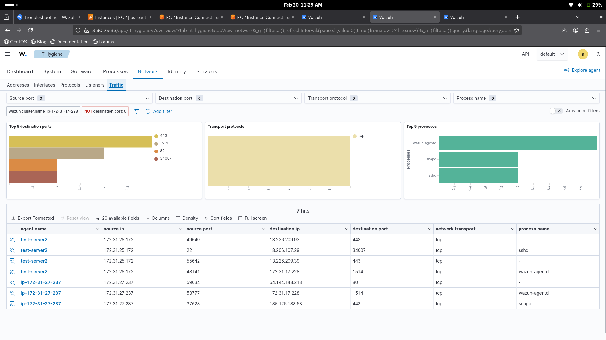

| **Status** | 🟢 Active | 🟢 Active |

### What We're Seeing

### Key TakeawayThe **GDPR compliance** module — relevant if you handle EU citizen data.


Both agents are:### GDPR Articles Tracked

- Same OS (Ubuntu 24.04.3 LTS)

- Same Wazuh version (v4.14.3)| Article | Focus |

- In the same group (`default`)|---|---|

- Both reporting to the same cluster node (`node01`)| **Art. 5** | Principles relating to processing of personal data |

- Both have action buttons for management (restart, upgrade, etc.)| **Art. 32** | Security of processing |

| **Art. 33** | Notification of a personal data breach (within 72 hours!) |

---| **Art. 35** | Data protection impact assessment |


## Step 17 — Configuration Assessment (SCA) Dashboard---


## 🏥 Step 21 — HIPAA Compliance Module


### What's Happening Here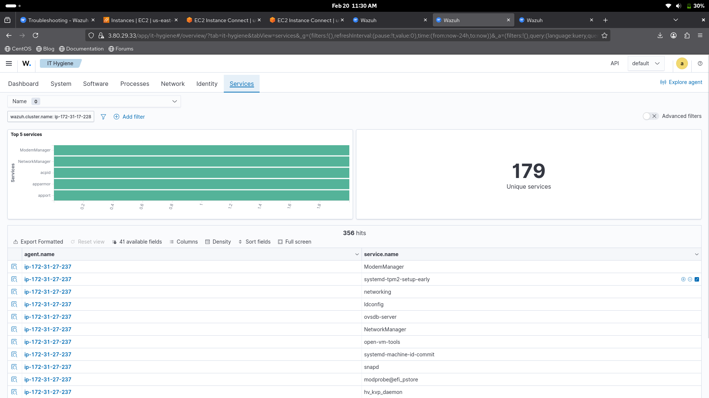


We're in the **Configuration Assessment (SCA)** module for `test-server2`. This module runs **CIS benchmark scans** to check if the system is configured securely.### What We're Seeing

The **HIPAA compliance** module — for healthcare organizations protecting patient data (PHI).

### What We See

### Key HIPAA Sections

| Element | Description |

|---|---|| Section | What It Covers |

| **Dashboard tab** | Overview charts and metrics ||---|---|

| **Inventory tab** | Detailed check-by-check results || **§164.308** | Administrative safeguards — risk analysis, access management |

| **Events tab** | Raw SCA events || **§164.310** | Physical safeguards — facility access, device controls |

| **Filter** | `manager.name: ip-172-31-17-228` and `rule.groups: sca` and `agent.id: 002` || **§164.312** | Technical safeguards — access control, audit controls, encryption |

| **Time range** | Last 24 hours |

---

> SCA scans run automatically when the agent is enrolled. It checks the system against CIS benchmarks and reports which checks **passed**, **failed**, or are **not applicable**.

## 🇺🇸 Step 22 — NIST 800-53 Compliance Module

---

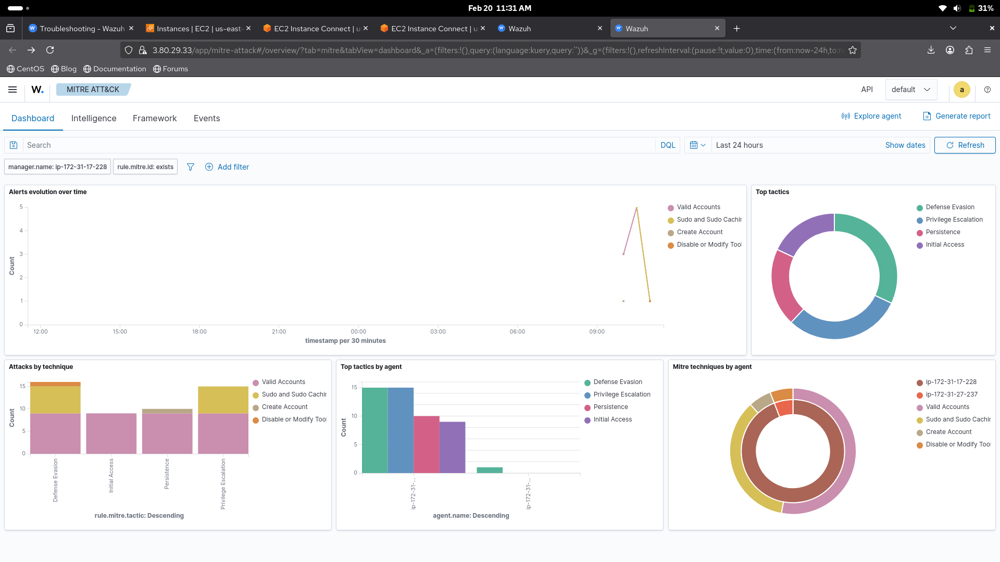

## Step 18 — Dashboard Overview with 2 Active Agents

### What We're Seeing

The **NIST 800-53** compliance module — the US federal security framework.


### What's Happening Here### Control Families Shown


Back to the **Overview** page. Now the dashboard has data because we have **2 active agents**:| Code | Family | Wazuh Coverage |

|---|---|---|

### Agents Summary| **AC** | Access Control | Authentication monitoring |

| **AU** | Audit & Accountability | Log collection, audit trails |

| Status | Count || **CM** | Configuration Management | SCA, FIM |

|---|---|| **IR** | Incident Response | Active Response |

| 🟢 Active | 2 || **SI** | System & Info Protection | Malware detection |

| 🔴 Disconnected | 0 |

---

### Modules Listed

## 🔐 Step 23 — TSC (SOC 2) Compliance Module

Now the Endpoint Security modules are visible and contain data:

- **Configuration Assessment** — SCA scan results available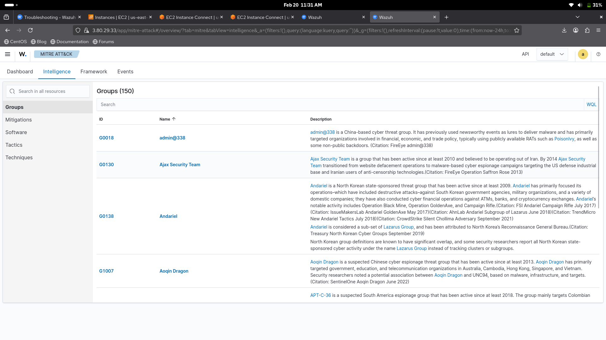

- **File Integrity Monitoring** — File change events being collected

- **Malware Detection** — Rootcheck running### What We're Seeing

The **TSC (Trust Services Criteria)** module — used for **SOC 2 audits**, essential for SaaS companies.

> Compare this to Step 3 — the dashboard was empty. Now with 2 agents sending data, all modules are populated.

### Five Trust Principles

---

| Principle | Wazuh Coverage |

## Step 19 — IT Hygiene: System Dashboard|---|---|

| **Security** | FIM, authentication monitoring, malware detection |

| **Availability** | System monitoring, agent status |

| **Processing Integrity** | Log integrity, FIM |

### What's Happening Here| **Confidentiality** | Access monitoring, encryption checks |

| **Privacy** | Data access monitoring |

We're exploring the **IT Hygiene** module (System Inventory). This shows the state of all monitored endpoints.

---

### Tabs Available

## 🐳 Step 24 — Docker (Container Security)

| Tab | What It Shows |

|---|---|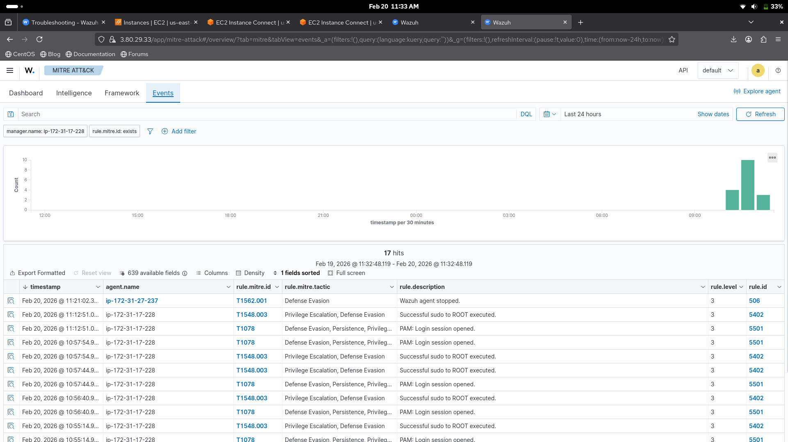

| **Dashboard** | Overview with charts ← We're here |

| **OS / Hardware** | Operating system and hardware info |### What We're Seeing

| **Platform** | Platform distribution |The **Docker** module showing container activity from hosts running Docker.

| **System** | System-level details |

| **Software** | Installed packages |### Events Monitored


### What We See| Event | Why It Matters |

|---|---|

| Element | Value || **Container created/started** | Tracking container lifecycle |

|---|---|| **Container running privileged** | ⚠️ Full host access — serious security risk |

| **Cluster** | `ip-172-31-17-228` || **Exec into container** | Someone running commands inside — could be attacker |

| **Top 5 Platforms** | `ubuntu` (both agents run Ubuntu) || **Image pulled** | New image downloaded — is it trusted? |

| **Network changes** | Container networking modified |

> This data is collected by the `<syscollector>` module in `ossec.conf`. It inventories all software, hardware, network, and processes on each agent.

---

---

## ☁️ Step 25 — AWS Security Module

## Step 20 — IT Hygiene: Network Tab

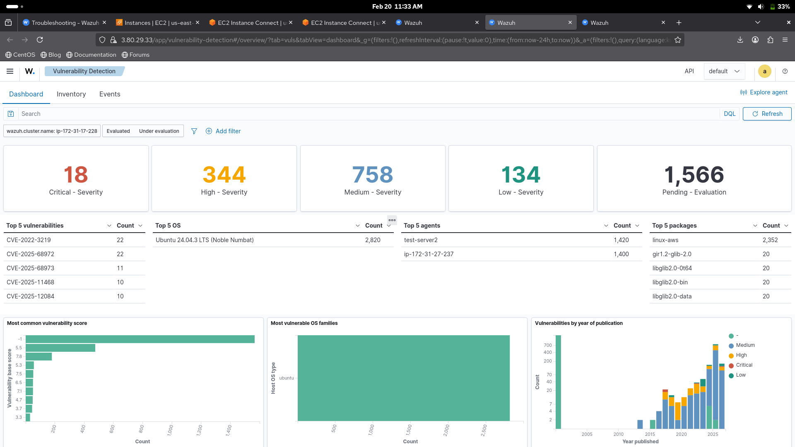


### What We're Seeing

### What's Happening HereThe **Amazon Web Services** module showing events collected from AWS APIs (CloudTrail, etc.).


We're in the **IT Hygiene → Network** tab. This shows network-related inventory data.### Key AWS Events to Watch


### Tabs in Network Section| Event | Risk Level |

|---|---|

`Addresses` → `Interfaces` → `Protocols` → `Listeners` → `Traffic`| IAM user created with admin access | 🔴 Critical |

| S3 bucket made public | 🔴 Critical |

### What We See| Security group opened to 0.0.0.0/0 | 🔴 Critical |

| Root account login | 🟠 High |

| Element | Details || Console login without MFA | 🟠 High |

|---|---|| API call from unusual region | 🟡 Medium |

| **Filter** | `NOT destination_port:0` (filtering out port 0 noise) |

| **Top 5 Destination Ports** | **443** (HTTPS) and **1514** (Wazuh agent communication) |---


### Why Ports 443 and 1514?## 🔵 Step 26 — Google Cloud (GCP) Module


| Port | Why It Appears |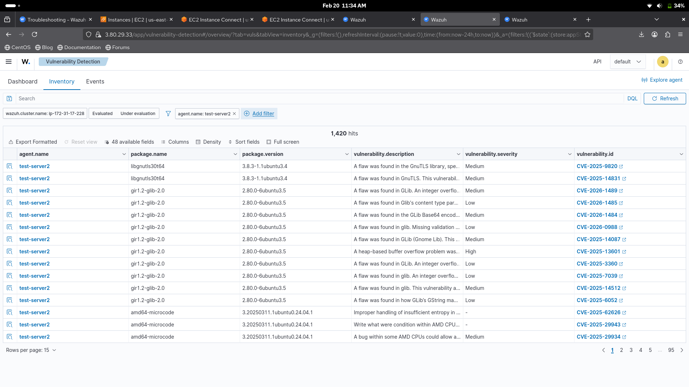

|---|---|

| **443** | Agents/browsers connecting to the Wazuh Dashboard |### What We're Seeing

| **1514** | Agents sending event data to the Wazuh Manager |The **Google Cloud** module showing security events from GCP services.


These are the two most critical ports in a Wazuh deployment. Seeing them here confirms the agents are communicating properly.### GCP Events Tracked

- **Audit logs** — Admin activity, data access

---- **IAM changes** — User/service account modifications

- **Compute Engine** — Instance lifecycle events

## Step 21 — IT Hygiene: Services Tab- **Cloud Storage** — Bucket access and policy changes

- **VPC** — Network configuration changes


---

### What's Happening Here

## 📫 Step 27 — Office 365 / GitHub / Additional Cloud

We're in the **IT Hygiene → Identity → Services** tab. This shows all running services discovered on the monitored agents.

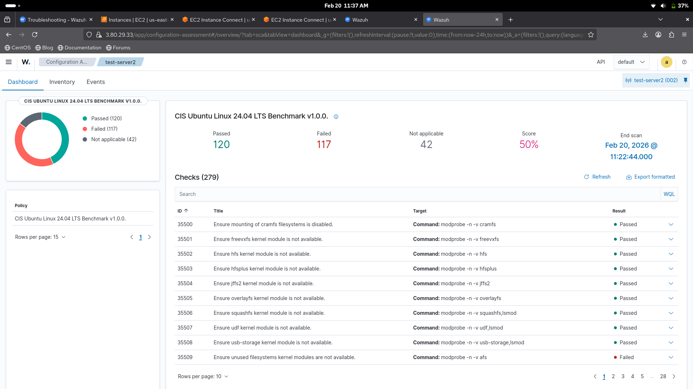

### What We See

### What We're Seeing

| Element | Details |Cloud service monitoring for **SaaS platforms** — Office 365, GitHub, or Microsoft Graph API.

|---|---|

| **Filter** | `wazuh.cluster.name: ip-172-31-17-228` |### Office 365 Events

| **Top 5 Services** | Listed services running across agents || Event | Why It Matters |

| **Service: apport** | Ubuntu crash reporting service ||---|---|

| **Total Unique Services** | 179 services discovered || Suspicious sign-in | Compromised account |

| Mail forwarding rule created | Data exfiltration via email |

### Why This Matters| External sharing enabled | Sensitive files exposed |

| Admin role assigned | Privilege escalation |

- **Unexpected services** = potential security risk (backdoor, unauthorized software)

- **Missing services** = something critical might not be running### GitHub Events

- Useful for **compliance audits** — verify only approved services are running| Event | Why It Matters |

|---|---|

---| Repository made public | Code exposure |

| Deploy key added | Persistent access |

## Step 22 — MITRE ATT&CK: Dashboard| Branch protection removed | Code integrity risk |

| External collaborator added | Unauthorized access |


---

### What's Happening Here

## ⚙️ Step 28 — Server Management / Settings

We're in the **MITRE ATT&CK** module — **Dashboard** tab. This maps Wazuh alerts to the MITRE ATT&CK framework.

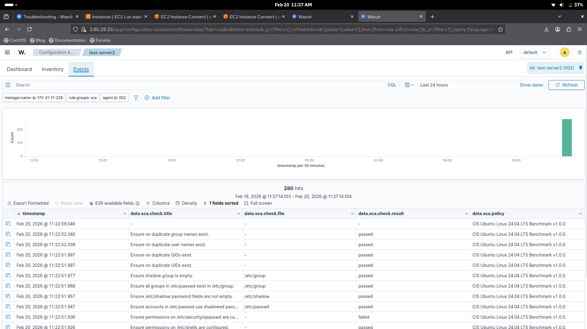

### What We See

### What We're Seeing

| Element | Description |The **Server Management** or **Settings** section of the Dashboard — where you manage the Wazuh platform itself.

|---|---|

| **Alerts evolution over time** | Timeline chart showing ATT&CK-tagged alerts |### What You Can Do Here

| **Top tactics** | Most detected tactics (e.g., Valid Accounts, Defense Evasion) |

| **Filter** | `manager.name: ip-172-31-17-228` and `rule.mitre.id: exists` || Section | Purpose |

| **Time range** | Last 24 hours ||---|---|

| **Status** | Check if all Wazuh services are running |

### What Are MITRE Tactics?| **Logs** | View server logs for troubleshooting |

| **Statistics** | Events per second, queue sizes, performance metrics |

| Tactic | What It Means || **Configuration** | View/edit server configuration |

|---|---|| **Rules** | Browse default and custom detection rules |

| **Valid Accounts** | Attackers using legitimate credentials || **Decoders** | Browse default and custom log decoders |

| **Defense Evasion** | Techniques to avoid detection || **CDB Lists** | Manage IOC databases (malware hashes, bad IPs) |

| **Persistence** | Maintaining access after initial compromise || **Groups** | Manage agent groups and shared configuration |

| **Privilege Escalation** | Gaining higher-level permissions || **API Console** | Direct API access for automation |

| **Ruleset Test** | Test how logs get decoded and which rules trigger |

> Every Wazuh rule can be mapped to MITRE ATT&CK tactics and techniques. This turns isolated alerts into a **coherent attack narrative**.

---

---

---

## Step 23 — MITRE ATT&CK: Intelligence Tab

# 📋 Complete Lab Summary


## What We Did (Step by Step)

### What's Happening Here

### Phase 1: Setup & Configuration

We're exploring the **MITRE ATT&CK → Intelligence** tab. This is a built-in reference database of threat intelligence.1. **Installed Wazuh** All-in-One on a single node (quickstart)

2. **Logged into the Dashboard** at `https://<ip>:443`

### Sections Available3. **Configured `ossec.conf`** to enable key modules:

   - `<global>` → Enabled JSON output + archives (`logall`)

| Section | What It Contains |   - `<rootcheck>` → Enabled rootkit/trojan detection

|---|---|   - `<syscollector>` → Enabled full system inventory

| **Groups** | 150+ known threat actor groups (APT28, Lazarus, etc.) |   - `<sca>` → Enabled CIS benchmark scanning

| **Mitigations** | Recommended countermeasures for each technique |   - `<vulnerability-detection>` → Enabled CVE detection

| **Software** | Known malware and tools used by threat actors |   - `<syscheck>` → Enabled File Integrity Monitoring

| **Tactics** | The 14 ATT&CK tactic categories |4. **Restarted the manager** → `sudo systemctl restart wazuh-manager`

| **Techniques** | Specific attack techniques with descriptions |

### Phase 2: Dashboard Exploration

### Why This Is Useful

| Screenshot | Module | Category | What We Explored |

You can **search for any threat group** and see:|---|---|---|---|

- What techniques they use| 1-2 | **Overview** | Home | Security events summary, alert levels, top agents |

- What software/malware they deploy| 3-4 | **Agents** | Management | Agent list, status, individual agent dashboard |

- What mitigations defend against them| 5-6 | **Configuration Assessment** | Endpoint Security | CIS benchmark results, pass/fail, remediation |

| 7 | **Malware Detection** | Endpoint Security | Rootkit alerts, IOC matches, suspicious files |

> This is built into Wazuh — no extra tools needed. It's like having a MITRE ATT&CK encyclopedia inside your SIEM.| 8-9 | **File Integrity Monitoring** | Endpoint Security | File changes, permissions, who/what/when |

| 10-11 | **Threat Hunting** | Threat Intelligence | Alert search, filtering, JSON drill-down |

---| 12-13 | **Vulnerability Detection** | Threat Intelligence | CVE inventory, severity, remediation |

| 14-15 | **MITRE ATT&CK** | Threat Intelligence | Tactics/techniques mapping, attack context |

## Step 24 — MITRE ATT&CK: Events Tab| 16-18 | **IT Hygiene** | Security Operations | System inventory — packages, ports, network |

| 19 | **PCI DSS** | Security Operations | Payment card compliance dashboard |

| 20 | **GDPR** | Security Operations | EU data privacy compliance |

| 21 | **HIPAA** | Security Operations | Healthcare data security compliance |

### What's Happening Here| 22 | **NIST 800-53** | Security Operations | Federal security controls compliance |

| 23 | **TSC** | Security Operations | SOC 2 audit readiness |

We're in the **MITRE ATT&CK → Events** tab. This shows the **raw alert data** for events that matched MITRE ATT&CK rules.| 24 | **Docker** | Cloud Security | Container lifecycle and security events |

| 25 | **AWS** | Cloud Security | CloudTrail, IAM, S3, security group events |

### What We See| 26 | **Google Cloud** | Cloud Security | GCP audit logs, IAM, compute events |

| 27 | **Office 365 / GitHub** | Cloud Security | SaaS platform security events |

| Element | Description || 28 | **Server Management** | Settings | Platform management, rules, decoders, API |

|---|---|

| **Filter** | `manager.name: ip-172-31-17-228` |---

| **Columns** | Timestamp, alert details |

| **Export** | `Export Formatted` button to download results |## 🧩 How the Config Maps to What We Saw

| **Timestamps** | Events from `Feb 20, 2026 @ 11:12` to `11:21` |

```

Each row is an individual alert that has been tagged with a MITRE ATT&CK technique ID. You can click any row to see the full JSON with:  ossec.conf                   Dashboard Module            Screenshots

- Rule ID and description  ──────────                  ──────────────              ────────────

- MITRE technique and tactic  <global>

- Agent details    logall=yes          ──▶   Threat Hunting              10-11

- Raw log data    alerts_log=yes      ──▶   All alert-based modules


---  <rootcheck>           ──▶   Malware Detection           7


## Step 25 — Vulnerability Detection: Dashboard  <syscollector>        ──▶   IT Hygiene (Inventory)      16-18

                        ──▶   Vulnerability Detection     12-13


  <sca>                 ──▶   Configuration Assessment    5-6

### What's Happening Here

  <vulnerability-       ──▶   Vulnerability Detection     12-13

We're in the **Vulnerability Detection** module — **Dashboard** tab. This shows all known CVEs (Common Vulnerabilities and Exposures) detected on our agents.    detection>


### Vulnerability Counts  <syscheck>            ──▶   File Integrity Monitoring   8-9


| Severity | Count |  <indexer>             ──▶   (Stores all indexed data)   All modules

|---|---|```

| 🔴 **Critical** | 18 |

| 🟠 **High** | 344 |---

| 🟡 **Medium** | 758 |

| 🔵 **Low** | 134 |## 💡 Key Takeaways from This Lab

| ⚪ **Pending Evaluation** | 1,566 |

### 1. Everything starts at `ossec.conf`

### Top Sections> If a module isn't enabled in the config, you'll see **empty dashboards** with no data. Always verify your config before troubleshooting "missing data."


| Section | What It Shows |### 2. The Dashboard has 4 clear categories

|---|---|> **Endpoint Security** (what's on your machines) → **Threat Intelligence** (what threats exist) → **Security Operations** (are you compliant?) → **Cloud Security** (what's in the cloud?)

| **Top 5 Vulnerabilities** | Most common CVEs (e.g., `CVE-2022-3219` — 22 occurrences) |

| **Top OS** | `Ubuntu 24.04.3 LTS (Noble Numbat)` — 2,820 vulnerabilities |### 3. Every alert answers the 5 WH questions

| **Top 5 Agents** | `test-server2` has the most vulnerabilities |> WHO, WHAT, WHERE, WHEN, HOW — if your alert doesn't answer these, it's a notification, not an alert.

| **Top 5 Packages** | Most vulnerable installed packages |

### 4. Compliance comes free

### How It Works> Every alert is automatically tagged with PCI DSS, GDPR, HIPAA, NIST, TSC mappings. You don't configure this separately — it's built into the rules.


1. The `<syscollector>` module inventories all installed packages### 5. The Investigation Workflow

2. The `<vulnerability-detection>` module cross-references package versions against CVE databases```

3. Results appear here with severity ratingsOverview (spot the spike) 

  → Threat Hunting (search & filter) 

> This is powered by `<vulnerability-detection><enabled>yes</enabled></vulnerability-detection>` in `ossec.conf`.    → Alert JSON (full context) 

      → MITRE ATT&CK (attack narrative) 

---        → Incident Response (take action)

```

## Step 26 — Vulnerability Detection: Events (Filtered by Agent)

### 6. Restart is mandatory

> `sudo systemctl restart wazuh-manager` — Nothing in `ossec.conf` takes effect without this step. Ever.


### What's Happening Here---


We're in the **Vulnerability Detection → Events** tab, filtered to show vulnerabilities for **test-server2** specifically.## 🔗 References

- Wazuh Dashboard: https://documentation.wazuh.com/current/getting-started/components/wazuh-dashboard.html

### What We See- Capabilities: https://documentation.wazuh.com/current/user-manual/capabilities/index.html

- ossec.conf Reference: https://documentation.wazuh.com/current/user-manual/reference/ossec-conf/index.html

| Element | Description |- SOC 201 Podcast: https://studywithurvesh.notion.site/SOC-201-Podcast-2cea317e9ac48071ab99c70e32795341

|---|---|
| **Filter** | `agent.name: test-server2` |
| **Status** | Evaluated / Under evaluation |
| **Total hits** | 1,420 vulnerabilities on this agent |
| **Columns** | Agent name, Package name, Package version, Vulnerability description, Severity |
| **Export** | Can export the full list as formatted data |

### Why This View Matters

This is where you do **per-agent vulnerability assessment**:
- Which packages on this specific server are vulnerable?
- What's the severity of each vulnerability?
- What should be patched first? (Critical → High → Medium → Low)

> 💡 **Pro Tip:** Filter by `vulnerability.severity: Critical` to focus on the most dangerous ones first.

---

## Step 27 — Configuration Assessment: CIS Benchmark Results


### What's Happening Here

We're in the **Configuration Assessment (SCA)** module for `test-server2`, viewing the **CIS Ubuntu Linux 24.04 LTS Benchmark v1.0.0** results.

### Scan Results

| Status | Count |
|---|---|
| ✅ **Passed** | 120 checks |
| ❌ **Failed** | 117 checks |
| ⬜ **Not Applicable** | 42 checks |

### What This Means

- **120 passed** — these security configurations are correctly set
- **117 failed** — these are **misconfigurations** that need to be fixed for hardening
- **42 not applicable** — checks that don't apply to this system

### Compliance Score

With 120 passed out of 237 applicable checks, the score is approximately **50.6%**. This means the system needs significant hardening.

### What To Do With Failed Checks

Click on any **failed check** to see:
- **What's wrong** — description of the misconfiguration
- **Rationale** — why it matters for security
- **Remediation** — exact commands to fix it
- **Compliance mapping** — which standards it violates (PCI DSS, HIPAA, etc.)

---

## Step 28 — Configuration Assessment: Events Tab


### What's Happening Here

We're in the **Configuration Assessment → Events** tab for `test-server2`. This shows the **raw SCA events** as a timeline.

### What We See

| Element | Description |
|---|---|
| **Filter** | `manager.name: ip-172-31-17-228` |
| **Columns** | Timestamp, event details |
| **Timeline** | Events plotted over time showing when SCA scans ran |
| **Count** | Number of SCA events generated |

### How SCA Events Work

Every time the SCA module runs a scan (by default every 12 hours), it generates events for each check:
- Check passed → event logged
- Check failed → event logged with alert
- Check status changed (was passing, now failing) → higher priority alert

> These events feed into the SCA Dashboard (Step 27) to calculate the pass/fail/not-applicable counts.

---

---

# 📋 Lab Summary

## What We Did (Complete Flow)

### Phase 1: Infrastructure Setup (AWS)

| Step | Screenshot | What We Did |
|---|---|---|
| 1 | `images/1.png` | SSH into Ubuntu EC2 instance |
| 2 | `images/2.png` | Ran Wazuh quickstart installation script |
| 3 | `images/3.png` | Accessed Dashboard — no agents yet |
| 4 | `images/4.png` | Explored Dashboard modules (sidebar) |

### Phase 2: Initial Dashboard Exploration

| Step | Screenshot | What We Did |
|---|---|---|
| 5 | `images/5.png` | Explored Discover tab — index patterns |
| 6 | `images/6.png` | Threat Hunting — authentication failure events |

### Phase 3: Agent Deployment

| Step | Screenshot | What We Did |
|---|---|---|
| 7 | `images/7.png` | Deploy Agent wizard — selected Linux |
| 8 | `images/8.png` | Selected DEB amd64 package type |
| 9 | `images/9.png` | Got the install command with server IP |
| 10 | `images/10.png` | Configured AWS Security Group (open ports 1514, 1515) |
| 11 | `images/11.png` | Verified 2 EC2 instances running |
| 12 | `images/12.png` | First agent enrolled and active |
| 13 | `images/13.png` | Viewed individual agent details |

### Phase 4: Second Agent Deployment

| Step | Screenshot | What We Did |
|---|---|---|
| 14 | `images/14.png` | AWS EC2 console — managing instances |
| 15 | `images/15.png` | Second agent enrolled (2 agents total) |
| 16 | `images/16.png` | Verified both agents active with details |

### Phase 5: Security Module Exploration

| Step | Screenshot | What We Did |
|---|---|---|
| 17 | `images/17.png` | Configuration Assessment (SCA) dashboard |
| 18 | `images/18.png` | Overview page — 2 active agents with data |
| 19 | `images/19.png` | IT Hygiene — system overview, platforms |
| 20 | `images/20.png` | IT Hygiene — network (ports 443, 1514) |
| 21 | `images/21.png` | IT Hygiene — services inventory |
| 22 | `images/22.png` | MITRE ATT&CK — dashboard, tactics |
| 23 | `images/23.png` | MITRE ATT&CK — intelligence database |
| 24 | `images/24.png` | MITRE ATT&CK — raw events |
| 25 | `images/25.png` | Vulnerability Detection — dashboard (18 Critical, 344 High) |
| 26 | `images/26.png` | Vulnerability Detection — events for test-server2 |
| 27 | `images/27.png` | Configuration Assessment — CIS Ubuntu benchmark (120 pass / 117 fail) |
| 28 | `images/28.png` | Configuration Assessment — events timeline |

---

## Key Takeaways

1. **Wazuh needs agents to show data** — an empty dashboard just means no agents are enrolled yet
2. **AWS Security Groups are critical** — port 1514/1515 must be open for agents to connect
3. **Agent deployment is simple** — the Dashboard wizard generates the exact install command
4. **IT Hygiene gives full inventory** — packages, ports, services, network interfaces
5. **MITRE ATT&CK is built-in** — alerts are automatically mapped to tactics and techniques
6. **Vulnerability Detection found 1,000+ CVEs** — even a fresh Ubuntu server has hundreds of known vulnerabilities
7. **CIS Benchmark score ~50%** — a default Ubuntu installation fails about half the security checks
8. **Everything connects back to `ossec.conf`** — modules must be enabled in config to generate data

---

## References

- Wazuh Quick Start: https://documentation.wazuh.com/current/quickstart.html
- Wazuh Agent Deployment: https://documentation.wazuh.com/current/installation-guide/wazuh-agent/index.html
- Wazuh Dashboard: https://documentation.wazuh.com/current/getting-started/components/wazuh-dashboard.html
- Capabilities: https://documentation.wazuh.com/current/user-manual/capabilities/index.html
- ossec.conf Reference: https://documentation.wazuh.com/current/user-manual/reference/ossec-conf/index.html
