<div align="center">

<!-- Animated Header -->


<!-- Animated Typing SVG -->
<a href="https://github.com/AbdurRazzaq2004/Wazuh-Security-Platform">
  
</a>

<br/><br/>

<!-- Badges Row 1 -->


<br/>

<!-- Tech Stack -->


<br/><br/>

<!-- Quick Stats -->

&nbsp;

&nbsp;

&nbsp;


</div>

<br/>

## About This Repository

A **complete, beginner-friendly documentation and lab guide** for the Wazuh Security Platform — covering every component, every dashboard module, configuration files, deployment strategies, and a full hands-on lab walkthrough with **28 screenshots**.

Built for **SOC Analysts**, **DevOps Engineers**, **Security Engineers**, and **students** diving into cybersecurity.

> **Learning Path:** &nbsp; 📖 Understand → 🔧 Configure → 🧪 Practice → 🚀 Deploy

---

## Architecture

```mermaid
flowchart LR
    subgraph EP["Endpoints"]
        A1["Linux"]
        A2["Windows"]
        A3["Docker"]
        A4["Cloud"]
    end

    subgraph AG["Wazuh Agent"]
        direction TB
        M1["Log Collector"]
        M2["FIM"]
        M3["SCA"]
        M4["Rootcheck"]
        M5["Syscollector"]
    end

    subgraph CC["Central Components"]
        S["Server<br/><i>Analysis Engine</i>"]
        I["Indexer<br/><i>Data Storage</i>"]
        D["Dashboard<br/><i>Visualization</i>"]
    end

    EP -->|"Agent<br/>Installed"| AG
    AG -->|"1514 / TCP<br/>AES-256"| S
    S -->|"9200 / HTTPS"| I
    I -->|"443 / HTTPS"| D

    style EP fill:#1a1a2e,stroke:#e94560,color:#fff
    style AG fill:#16213e,stroke:#0f3460,color:#fff
    style CC fill:#0f3460,stroke:#533483,color:#fff
```

<div align="center">



</div>

<details>
<summary><b>Communication Ports & Protocols</b></summary>

<br/>

| From | To | Port | Protocol | Purpose |
|:---|:---|:---:|:---|:---|
| Agent | Server | `1514` | TCP / AES-256 | Event data transmission |
| Agent | Server | `1515` | TCP / TLS | Agent enrollment |
| Server | Indexer | `9200` | HTTPS | Alert indexing |
| Dashboard | Indexer | `9200` | HTTPS | Data queries |
| User | Dashboard | `443` | HTTPS | Web interface |
| User | Server API | `55000` | HTTPS | RESTful API |

</details>

---

## Documentation

| # | Document | Description |
|:---:|:---|:---|
| 00 | [**Wazuh Overview**](./00-wazuh-overview.md) | What is Wazuh — capabilities, architecture at a glance |
| 01 | [**Wazuh Agent**](./01-wazuh-agent.md) | All 9 agent modules — Log Collector, FIM, SCA, Rootcheck, Syscollector, Active Response, Container & Cloud |
| 02 | [**Wazuh Server**](./02-wazuh-server.md) | Analysis Engine, Decoders, Rules, RESTful API, Cluster, Filebeat |
| 03 | [**Wazuh Indexer**](./03-wazuh-indexer.md) | JSON documents, indices, shards, replicas, near real-time search |
| 04 | [**Wazuh Dashboard**](./04-wazuh-dashboard.md) | Visualization, agent management, RBAC, SSO |
| 05 | [**Architecture**](./05-wazuh-architecture.md) | Full architecture, communication flows, 3 deployment options |
| 06 | [**Use Cases**](./06-wazuh-use-cases.md) | 10 real-world security use cases with examples |
| 07 | [**Deployment Strategy**](./07-single-node-vs-multi-node.md) | Single-node vs multi-node — when to use which |
| 08 | [**Dashboard Modules**](./08-wazuh-dashboard-modules.md) | All 18 modules across 4 categories + SOC 201 detection notes |
| 09 | [**ossec.conf Explained**](./09-ossec-conf-explained.md) | Line-by-line config breakdown — the heart of Wazuh |
| 10 | [**Lab Walkthrough**](./10-wazuh-lab-walkthrough.md) | Complete hands-on lab with 28 annotated screenshots |

---

## Core Components

<table>
<tr>
<td width="25%" align="center"><h3>� Agent</h3></td>
<td width="25%" align="center"><h3>⚙️ Server</h3></td>
<td width="25%" align="center"><h3>🗄️ Indexer</h3></td>
<td width="25%" align="center"><h3>📊 Dashboard</h3></td>
</tr>
<tr>
<td valign="top">

- Log Collector
- FIM (Syscheck)
- SCA
- Rootcheck
- Syscollector
- Active Response
- Container Security
- Cloud Security

</td>
<td valign="top">

- Analysis Engine
- Decoders
- Rules (3000+)
- RESTful API
- Cluster Daemon
- Threat Intel
- Filebeat
- Integrations

</td>
<td valign="top">

- JSON Storage
- Full-Text Search
- Shards & Replicas
- Near Real-Time
- REST API
- Alerting
- Role-Based Access

</td>
<td valign="top">

- Data Visualization
- Agent Management
- 18 Security Modules
- RBAC & SSO
- Dev Tools
- Compliance Views
- MITRE ATT&CK

</td>
</tr>
</table>

---

## Use Cases

| Category | Use Case | Description |
|:---|:---|:---|
| **Endpoint Security** | Configuration Assessment | CIS benchmark scanning — checks if systems are hardened |
| **Endpoint Security** | Malware Detection | Rootkit scanning, IOC matching, suspicious file detection |
| **Endpoint Security** | File Integrity Monitoring | Tracks who changed what file, when, and how |
| **Threat Intelligence** | Threat Hunting | Raw alert search — the SOC analyst's primary workspace |
| **Threat Intelligence** | Vulnerability Detection | CVE scanning — finds known vulnerabilities in installed packages |
| **Threat Intelligence** | MITRE ATT&CK | Maps every alert to adversary tactics & techniques |
| **Compliance** | PCI DSS · GDPR · HIPAA · NIST · TSC | Auto-tags alerts with compliance framework mappings |
| **Cloud Security** | AWS · GCP · Azure | Monitors cloud API calls, IAM changes, storage events |
| **Cloud Security** | Docker & Kubernetes | Container lifecycle, privileged mode, exec detection |
| **Incident Response** | Active Response | Auto-blocks IPs, kills processes, quarantines files |

---

## Lab Walkthrough

The [**Lab Walkthrough**](./10-wazuh-lab-walkthrough.md) documents a complete exploration of the Wazuh Dashboard with **28 annotated screenshots**.

<details>
<summary><b>Screenshot Coverage Map</b></summary>

<br/>

| Screenshots | Module | Category |
|:---|:---|:---|
| `1` – `2` | Dashboard Overview & Security Events | Home |
| `3` – `4` | Agents List & Individual Agent View | Management |
| `5` – `6` | Configuration Assessment (SCA / CIS) | Endpoint Security |
| `7` | Malware Detection | Endpoint Security |
| `8` – `9` | File Integrity Monitoring (FIM) | Endpoint Security |
| `10` – `11` | Threat Hunting & Alert JSON | Threat Intelligence |
| `12` – `13` | Vulnerability Detection & CVE Details | Threat Intelligence |
| `14` – `15` | MITRE ATT&CK Framework | Threat Intelligence |
| `16` – `18` | IT Hygiene / System Inventory | Security Operations |
| `19` | PCI DSS Compliance | Security Operations |
| `20` | GDPR Compliance | Security Operations |
| `21` | HIPAA Compliance | Security Operations |
| `22` | NIST 800-53 Compliance | Security Operations |
| `23` | TSC (SOC 2) Compliance | Security Operations |
| `24` | Docker Container Security | Cloud Security |
| `25` | AWS Cloud Security | Cloud Security |
| `26` | Google Cloud Security | Cloud Security |
| `27` | Office 365 / GitHub | Cloud Security |
| `28` | Server Management & Settings | Administration |

</details>

---

## Configuration ↔ Dashboard Mapping

Every module in the Wazuh Dashboard is powered by a section in **`/var/ossec/etc/ossec.conf`**. If it's not enabled in the config, the dashboard shows **no data**.

| ossec.conf Section | Dashboard Module | Status |
|:---|:---|:---:|
| `<global>` | All alert-based modules | ✅ Core |
| `<rootcheck>` | Malware Detection | ✅ Enabled |
| `<syscheck>` | File Integrity Monitoring | ✅ Enabled |
| `<sca>` | Configuration Assessment | ✅ Enabled |
| `<syscollector>` | IT Hygiene / Inventory | ✅ Enabled |
| `<vulnerability-detection>` | Vulnerability Detection | ✅ Enabled |
| `<indexer>` | Data Storage (`127.0.0.1`) | ✅ Configured |

> ⚠️ **After editing ossec.conf:** `sudo systemctl restart wazuh-manager`

See [**ossec.conf Explained**](./09-ossec-conf-explained.md) for a line-by-line breakdown of the entire configuration.

---

## Quick Start

```bash
# Download and run the Wazuh installation assistant (single-node, all-in-one)
curl -sO https://packages.wazuh.com/4.10/wazuh-install.sh
sudo bash ./wazuh-install.sh -a
```

```
Dashboard URL  →  https://<your-server-ip>:443
Username       →  admin
Password       →  (printed after installation)
```

> See [**Deployment Strategy**](./07-single-node-vs-multi-node.md) for single-node vs multi-node details.

---

## Repository Structure

```
Wazuh-Security-Platform/
│
├── README.md                           # This file
├── requirement.txt                     # Prerequisites
├── image.png                           # Architecture diagram
├── images/                             # 28 lab screenshots (1.png – 28.png)
│
├── 00-wazuh-overview.md                # What is Wazuh?
├── 01-wazuh-agent.md                   # Agent deep-dive (9 modules)
├── 02-wazuh-server.md                  # Server components
├── 03-wazuh-indexer.md                 # Indexer & data storage
├── 04-wazuh-dashboard.md               # Dashboard features
├── 05-wazuh-architecture.md            # Full architecture
├── 06-wazuh-use-cases.md               # 10 real-world use cases
├── 07-single-node-vs-multi-node.md     # Deployment strategies
├── 08-wazuh-dashboard-modules.md       # All 18 dashboard modules
├── 09-ossec-conf-explained.md          # Config file explained
└── 10-wazuh-lab-walkthrough.md         # Lab with 28 screenshots
```

---

## Key Takeaways

1. **Wazuh = XDR + SIEM** — free and open source
2. **4 Components** — Agent → Server → Indexer → Dashboard
3. **Everything starts at `ossec.conf`** — if a module isn't enabled, the dashboard is empty
4. **18 Dashboard Modules** across 4 categories — Endpoint, Threat Intel, Compliance, Cloud
5. **Compliance comes built-in** — PCI DSS, GDPR, HIPAA, NIST 800-53, TSC auto-tagged on every alert
6. **MITRE ATT&CK** turns isolated alerts into coherent attack narratives
7. **Every alert answers 5 questions** — Who, What, Where, When, How
8. **Single node for labs** — multi-node for production

---

## References

| Resource | Link |
|:---|:---|
| Wazuh Official Docs | [documentation.wazuh.com](https://documentation.wazuh.com/current/) |
| Quick Start Guide | [quickstart.html](https://documentation.wazuh.com/current/quickstart.html) |
| Components | [Architecture Overview](https://documentation.wazuh.com/current/getting-started/components/index.html) |
| Capabilities | [All Capabilities](https://documentation.wazuh.com/current/user-manual/capabilities/index.html) |
| ossec.conf Reference | [Config Reference](https://documentation.wazuh.com/current/user-manual/reference/ossec-conf/index.html) |
| SOC 201 Podcast | [Study Notes](https://studywithurvesh.notion.site/SOC-201-Podcast-2cea317e9ac48071ab99c70e32795341) |

---

<div align="center">

**Made with ❤️ by [Abdur Razzaq](https://github.com/AbdurRazzaq2004)**

*"Security is not a product, but a process."* — Bruce Schneier

<br/>


</div>
