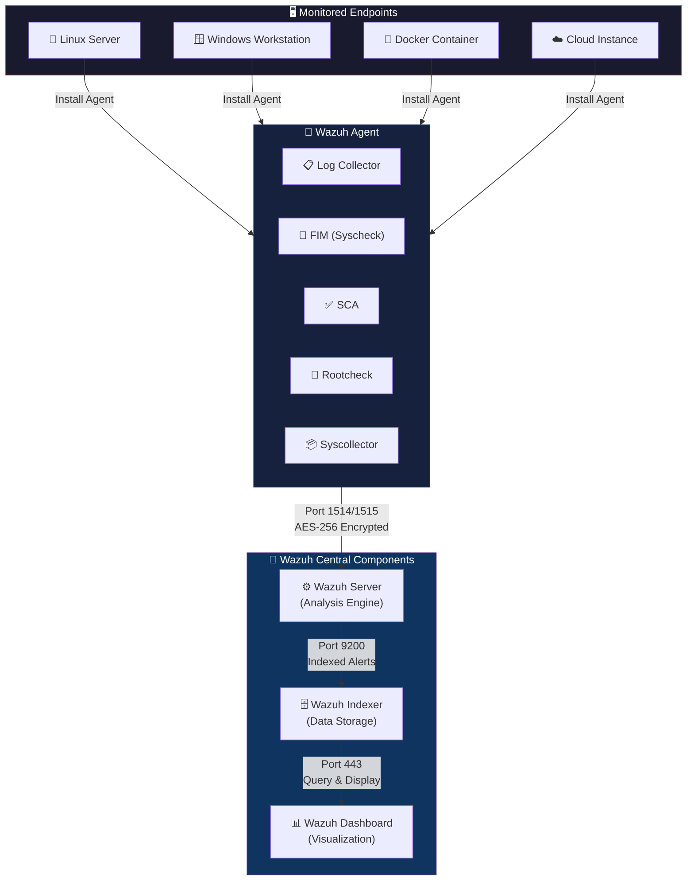

<div align="center">

<!-- Animated Header -->


<!-- Animated Typing SVG -->
<a href="https://github.com/AbdurRazzaq2004/Wazuh-Security-Platform">
  
</a>

<br/>

<!-- Badges -->


<br/><br/>

<!-- Tech Stack Icons -->


<br/><br/>

<!-- Stats -->


</div>

---

## 🌟 What Is This Repository?

> **A complete, beginner-friendly documentation and lab guide for the Wazuh Security Platform** — covering every component, every dashboard module, configuration files, deployment strategies, and a full hands-on lab walkthrough with 28 screenshots.

Whether you're a **SOC Analyst**, **DevOps Engineer**, **Security Engineer**, or a **student** diving into cybersecurity — this repo is your **one-stop reference** for understanding Wazuh inside out.

<div align="center">

```
  ╔══════════════════════════════════════════════════════════════╗
  ║                                                              ║
  ║   📖 Learn Wazuh  →  🔧 Configure It  →  🧪 Lab It  →  🚀   ║
  ║                                                              ║
  ╚══════════════════════════════════════════════════════════════╝
```

</div>

---

## 🏗️ Architecture Overview

<div align="center">



</div>

### Communication Flow

| From | To | Port | Protocol | Purpose |
|:---:|:---:|:---:|:---:|:---|
| 🔌 Agent | ⚙️ Server | `1514` | TCP (AES-256) | Event data transmission |
| 🔌 Agent | ⚙️ Server | `1515` | TCP (TLS) | Agent enrollment |
| ⚙️ Server | 🗄️ Indexer | `9200` | HTTPS | Alert indexing |
| 📊 Dashboard | 🗄️ Indexer | `9200` | HTTPS | Data queries |
| 👤 User | 📊 Dashboard | `443` | HTTPS | Web interface access |
| 👤 User | ⚙️ Server API | `55000` | HTTPS | RESTful API access |

---

## 📚 Documentation Index

<div align="center">

| # | File | Topic | Description |
|:---:|:---|:---:|:---|
| 00 | [`00-wazuh-overview.md`](./00-wazuh-overview.md) | 🛡️ **Overview** | What is Wazuh, capabilities, architecture at a glance |
| 01 | [`01-wazuh-agent.md`](./01-wazuh-agent.md) | 🔌 **Agent** | All 9 agent modules — Log Collector, FIM, SCA, Rootcheck, Syscollector, Malware, Active Response, Container & Cloud Security |
| 02 | [`02-wazuh-server.md`](./02-wazuh-server.md) | ⚙️ **Server** | Analysis Engine, Decoders, Rules, API, Cluster, Filebeat |
| 03 | [`03-wazuh-indexer.md`](./03-wazuh-indexer.md) | 🗄️ **Indexer** | JSON documents, indices, shards, replicas, near real-time search |
| 04 | [`04-wazuh-dashboard.md`](./04-wazuh-dashboard.md) | 📊 **Dashboard** | Data visualization, agent management, RBAC, SSO |
| 05 | [`05-wazuh-architecture.md`](./05-wazuh-architecture.md) | 🏗️ **Architecture** | Full architecture, communication flows, deployment options |
| 06 | [`06-wazuh-use-cases.md`](./06-wazuh-use-cases.md) | 🎯 **Use Cases** | 10 real-world use cases with examples |
| 07 | [`07-single-node-vs-multi-node.md`](./07-single-node-vs-multi-node.md) | 🖥️ **Deployment** | Single-node vs multi-node, when to use which |
| 08 | [`08-wazuh-dashboard-modules.md`](./08-wazuh-dashboard-modules.md) | 📋 **Dashboard Modules** | All 18 modules across 4 categories + SOC 201 notes |
| 09 | [`09-ossec-conf-explained.md`](./09-ossec-conf-explained.md) | ⚙️ **ossec.conf** | Line-by-line config explanation — the heart of Wazuh |
| 10 | [`10-wazuh-lab-walkthrough.md`](./10-wazuh-lab-walkthrough.md) | 🧪 **Lab Walkthrough** | Full hands-on lab with 28 annotated screenshots |

</div>

---

## 🧩 The Four Pillars of Wazuh

<div align="center">

```
┌─────────────────────────────────────────────────────────────────────────┐
│                        🛡️  WAZUH SECURITY PLATFORM                      │
├─────────────────┬──────────────────┬────────────────┬───────────────────┤
│  🔌 AGENT       │  ⚙️ SERVER        │  🗄️ INDEXER     │  📊 DASHBOARD     │
├─────────────────┼──────────────────┼────────────────┼───────────────────┤
│ Log Collector   │ Analysis Engine  │ JSON Storage   │ Data Viz          │
│ FIM (Syscheck)  │ Decoders         │ Full-Text      │ Agent Mgmt        │
│ SCA             │ Rules (3000+)    │   Search       │ 18 Modules        │
│ Rootcheck       │ RESTful API      │ Shards &       │ RBAC & SSO        │
│ Syscollector    │ Cluster Daemon   │   Replicas     │ Dev Tools         │
│ Active Response │ Threat Intel     │ Near Real-Time │ Compliance        │
│ Container Sec   │ Filebeat         │ REST API       │   Dashboards      │
│ Cloud Security  │ Integrations     │ Alerting       │ MITRE ATT&CK     │
└─────────────────┴──────────────────┴────────────────┴───────────────────┘
```

</div>

---

## 🎯 Wazuh Use Cases at a Glance

<div align="center">

| Category | Use Case | What Wazuh Does |
|:---|:---|:---|
| 🔒 **Endpoint Security** | Configuration Assessment | CIS benchmark scanning → checks if systems are hardened |
| 🦠 **Endpoint Security** | Malware Detection | Rootkit scanning, IOC matching, suspicious file detection |
| 📁 **Endpoint Security** | File Integrity Monitoring | Tracks WHO changed WHAT file, WHEN, and HOW |
| 🔎 **Threat Intelligence** | Threat Hunting | Raw alert search — the SOC analyst's primary workspace |
| 💀 **Threat Intelligence** | Vulnerability Detection | CVE scanning — finds known vulnerabilities in your software |
| ⚔️ **Threat Intelligence** | MITRE ATT&CK | Maps every alert to adversary tactics & techniques |
| 📋 **Compliance** | PCI DSS, GDPR, HIPAA, NIST, TSC | Auto-tags alerts with compliance framework mappings |
| ☁️ **Cloud Security** | AWS, GCP, Azure | Monitors cloud API calls, IAM changes, storage events |
| 🐳 **Cloud Security** | Docker & Kubernetes | Container lifecycle, privileged mode, exec detection |
| ⚡ **Incident Response** | Active Response | Auto-blocks IPs, kills processes, quarantines files |

</div>

---

## 🧪 Lab Screenshots Preview

> The [`10-wazuh-lab-walkthrough.md`](./10-wazuh-lab-walkthrough.md) contains a **complete walkthrough** of the Wazuh dashboard with **28 annotated screenshots** covering every module.

<div align="center">

```
  📸 Lab Screenshot Coverage (28 Screenshots)
  ═══════════════════════════════════════════

  Screenshots 1-2   → 🏠 Dashboard Overview & Security Events
  Screenshots 3-4   → 🔌 Agents List & Individual Agent View
  Screenshots 5-6   → ✅ Configuration Assessment (SCA/CIS)
  Screenshot  7     → 🦠 Malware Detection
  Screenshots 8-9   → 📁 File Integrity Monitoring (FIM)
  Screenshots 10-11 → 🔎 Threat Hunting & Alert JSON
  Screenshots 12-13 → 💀 Vulnerability Detection & CVE Details
  Screenshots 14-15 → ⚔️ MITRE ATT&CK Framework
  Screenshots 16-18 → 🔧 IT Hygiene / System Inventory
  Screenshot  19    → 💳 PCI DSS Compliance
  Screenshot  20    → 🇪🇺 GDPR Compliance
  Screenshot  21    → 🏥 HIPAA Compliance
  Screenshot  22    → 🇺🇸 NIST 800-53 Compliance
  Screenshot  23    → 🔐 TSC (SOC 2) Compliance
  Screenshot  24    → 🐳 Docker Container Security
  Screenshot  25    → ☁️ AWS Cloud Security
  Screenshot  26    → 🔵 Google Cloud Security
  Screenshot  27    → 📫 Office 365 / GitHub
  Screenshot  28    → ⚙️ Server Management & Settings
```

</div>

---

## ⚙️ The ossec.conf — Heart of Wazuh

> Every module in the Wazuh Dashboard is powered by a section in `/var/ossec/etc/ossec.conf`. If it's not enabled in config, the dashboard will be **empty**.

<div align="center">

```
  ossec.conf Section              Dashboard Module            Status
  ══════════════════              ════════════════            ══════
  <global>                   ──▶  All alert modules           ✅ Core
  <rootcheck>                ──▶  Malware Detection           ✅ Enabled
  <syscheck>                 ──▶  File Integrity Monitoring   ✅ Enabled
  <sca>                      ──▶  Configuration Assessment    ✅ Enabled
  <syscollector>             ──▶  IT Hygiene / Inventory      ✅ Enabled
  <vulnerability-detection>  ──▶  Vulnerability Detection     ✅ Enabled
  <indexer>                  ──▶  Data Storage (127.0.0.1)    ✅ Configured

  ⚠️  After editing ossec.conf:
  $ sudo systemctl restart wazuh-manager
```

</div>

See [`09-ossec-conf-explained.md`](./09-ossec-conf-explained.md) for a **line-by-line breakdown** of the entire configuration file.

---

## 🚀 Quick Start — Single Node Deployment

```bash
# Download and run the Wazuh installation assistant
curl -sO https://packages.wazuh.com/4.10/wazuh-install.sh
sudo bash ./wazuh-install.sh -a

# Access the dashboard
# URL:      https://<your-server-ip>:443
# User:     admin
# Password: (shown after installation)
```

> 📖 See [`07-single-node-vs-multi-node.md`](./07-single-node-vs-multi-node.md) for deployment strategy details.

---

## 📂 Repository Structure

```
📦 Wazuh-Security-Platform
├── 📄 README.md                          ← You are here!
├── 📄 requirement.txt                    ← Prerequisites
├── 🖼️ image.png                          ← Architecture diagram
├── 📁 images/                            ← 28 lab screenshots
│   ├── 1.png ... 28.png
│
├── 📖 00-wazuh-overview.md               ← What is Wazuh?
├── 📖 01-wazuh-agent.md                  ← Agent deep-dive (9 modules)
├── 📖 02-wazuh-server.md                 ← Server components
├── 📖 03-wazuh-indexer.md                ← Indexer (data storage)
├── 📖 04-wazuh-dashboard.md              ← Dashboard features
├── 📖 05-wazuh-architecture.md           ← Full architecture
├── 📖 06-wazuh-use-cases.md              ← 10 real-world use cases
├── 📖 07-single-node-vs-multi-node.md    ← Deployment strategies
├── 📖 08-wazuh-dashboard-modules.md      ← All 18 dashboard modules
├── 📖 09-ossec-conf-explained.md         ← Config file explained
└── 📖 10-wazuh-lab-walkthrough.md        ← Lab with 28 screenshots
```

---

## 🔗 References & Resources

<div align="center">

| Resource | Link |
|:---|:---|
| 🌐 Wazuh Official Docs | [documentation.wazuh.com](https://documentation.wazuh.com/current/) |
| 📦 Wazuh Quick Start | [Quick Start Guide](https://documentation.wazuh.com/current/quickstart.html) |
| 🏗️ Components | [Architecture Overview](https://documentation.wazuh.com/current/getting-started/components/index.html) |
| 🎯 Capabilities | [All Capabilities](https://documentation.wazuh.com/current/user-manual/capabilities/index.html) |
| ⚙️ ossec.conf Reference | [Config Reference](https://documentation.wazuh.com/current/user-manual/reference/ossec-conf/index.html) |
| 🎓 SOC 201 Podcast | [Study Notes](https://studywithurvesh.notion.site/SOC-201-Podcast-2cea317e9ac48071ab99c70e32795341) |
| 📺 Wazuh YouTube | [Official Channel](https://www.youtube.com/@wazuh) |

</div>

---

## 💡 Key Takeaways

<div align="center">

```
  ┌────────────────────────────────────────────────────────────────┐
  │                                                                │
  │  1️⃣  Wazuh = XDR + SIEM (Free & Open Source)                   │
  │  2️⃣  4 Components: Agent → Server → Indexer → Dashboard        │
  │  3️⃣  Everything starts at ossec.conf                           │
  │  4️⃣  18 Dashboard Modules across 4 categories                  │
  │  5️⃣  Compliance comes FREE (PCI DSS, GDPR, HIPAA, NIST, TSC)  │
  │  6️⃣  MITRE ATT&CK maps alerts to attack narratives            │
  │  7️⃣  Every alert answers: WHO, WHAT, WHERE, WHEN, HOW         │
  │  8️⃣  Single node for labs, multi-node for production           │
  │                                                                │
  └────────────────────────────────────────────────────────────────┘
```

</div>

---

## 👨‍💻 Author

<div align="center">

Made with ❤️ by **Abdur Razzaq**

[](https://github.com/AbdurRazzaq2004)

<br/>

*"Security is not a product, but a process."* — Bruce Schneier

</div>

---

<div align="center">

<!-- Animated Footer -->


</div>
