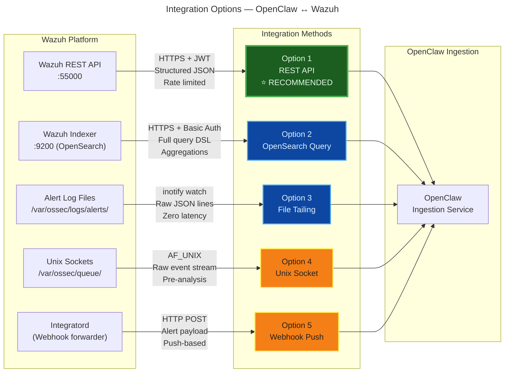
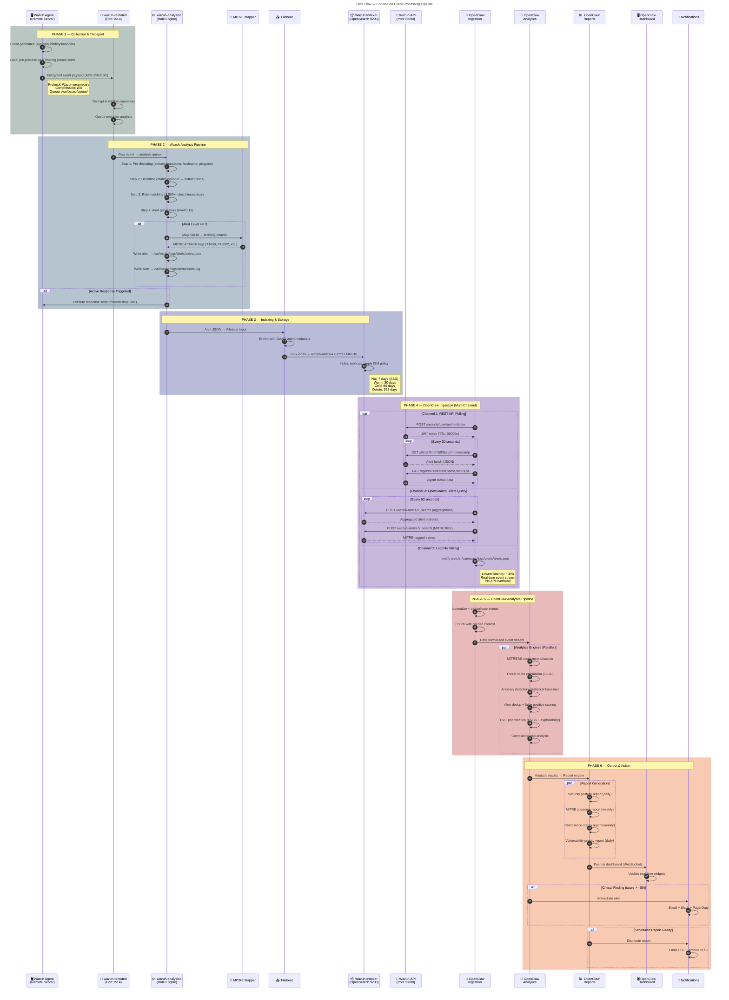
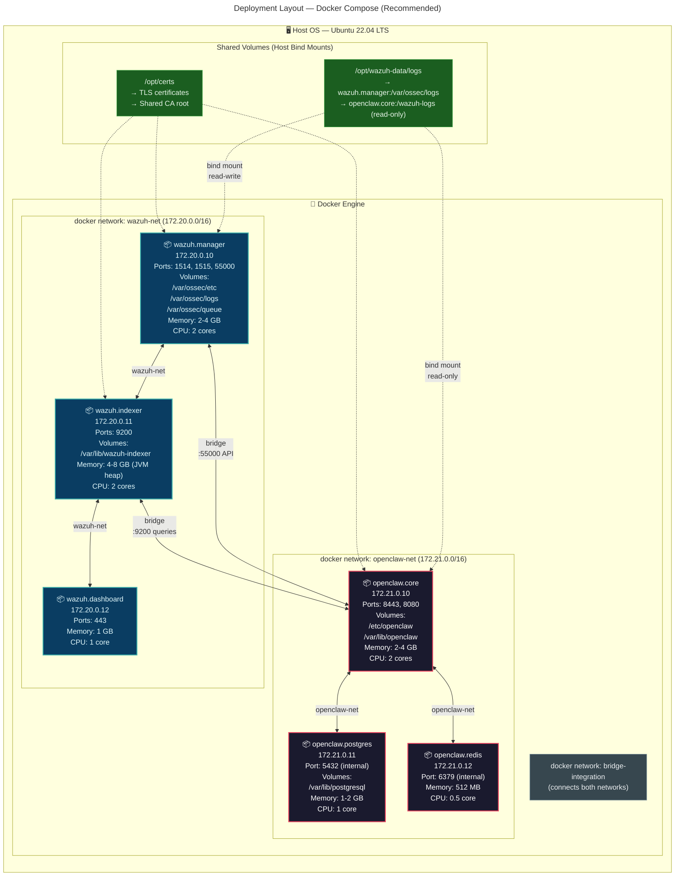
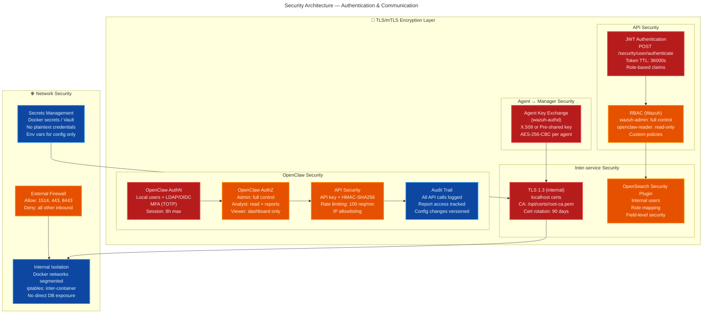
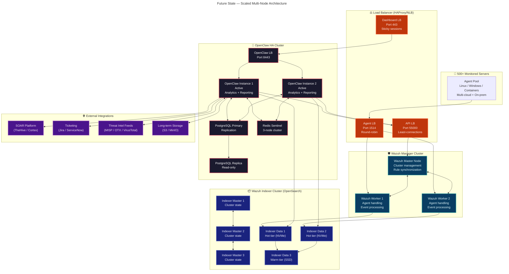

# OpenClaw + Wazuh — Production Architecture & System Design

> **Document Type:** Architecture Design Document (ADD)
> **Classification:** Internal — DevSecOps
> **Version:** 2.0
> **Date:** 2026-02-28
> **Author:** Senior DevSecOps Architect
> **Status:** Draft — Pending Review

---

## Table of Contents

1. [Executive Summary](#1-executive-summary)
2. [Architecture Diagram](#2-architecture-diagram)
3. [Component Breakdown](#3-component-breakdown)
4. [Data Flow — Step by Step](#4-data-flow--step-by-step)
5. [Integration Options](#5-integration-options)
6. [Deployment Strategy](#6-deployment-strategy)
7. [Security Considerations](#7-security-considerations)
8. [Future Scalability](#8-future-scalability)
9. [Assumptions & Constraints](#9-assumptions--constraints)
10. [Appendix](#10-appendix)

---

## 1. Executive Summary

### 1.1 Objective

Deploy **Wazuh** (SIEM + XDR) and **OpenClaw** (intelligence and monitoring layer) on a **single server** as an integrated security monitoring platform. Wazuh is the data collection and detection engine. OpenClaw is the higher-level observer, analyzer, and reporter — it does **not** replace Wazuh but augments it with continuous monitoring, advanced correlation, and automated reporting.

### 1.2 Responsibility Matrix

| Responsibility | Wazuh | OpenClaw |
|---|:---:|:---:|
| Agent management & enrollment | **Primary** | — |
| Log collection from endpoints | **Primary** | — |
| Intrusion detection (IDS rules) | **Primary** | — |
| MITRE ATT&CK tagging | **Primary** | Correlates |
| Vulnerability detection | **Primary** | Prioritizes |
| File integrity monitoring | **Primary** | Observes |
| Compliance assessment | **Primary** | Reports |
| Active response (blocking) | **Primary** | — |
| Continuous monitoring of Wazuh | — | **Primary** |
| Advanced threat correlation | — | **Primary** |
| Cross-agent pattern analysis | — | **Primary** |
| Aggregated reporting (PDF/HTML) | — | **Primary** |
| Kill chain reconstruction | — | **Primary** |
| Alert deduplication & scoring | — | **Primary** |
| Executive dashboards | — | **Primary** |
| Notification dispatch | — | **Primary** |

### 1.3 Explicit Assumptions

1. **OpenClaw is not a Wazuh replacement.** It consumes Wazuh outputs and adds intelligence.
2. **Single-server deployment** is the initial target. Scaling strategy is documented in Section 8.
3. **Wazuh 4.x** (latest stable) is the target version.
4. **Docker-based deployment** is recommended (bare metal alternative documented).
5. **OpenClaw** is assumed to support REST API ingestion, file-based log consumption, and OpenSearch queries. If specific features are unavailable, fallback paths are documented.
6. Server OS is **Ubuntu 22.04 LTS** (or equivalent RHEL 9 / Amazon Linux 2023).

---

## 2. Architecture Diagram

### 2.1 Full Production Architecture

This is the primary reference diagram. Every component, port, process, and data path is shown.

```mermaid
---
title: "OpenClaw + Wazuh — Production Architecture (Single Server)"
---
flowchart TB
    subgraph INTERNET["☁️ NETWORK PERIMETER"]
        direction LR
        FW["Firewall / Security Group\nInbound: 1514/TCP, 1515/TCP, 443/TCP, 8443/TCP\nOutbound: 53/UDP, 443/TCP (NVD/CTI feeds)"]
    end

    subgraph AGENTS["📡 MONITORED INFRASTRUCTURE — Wazuh Agents"]
        direction LR
        subgraph AZ1["Availability Zone 1"]
            A1["🐧 Linux Web Server\nWazuh Agent 4.x\nossec.conf → manager IP\nSyslog + Auditd + FIM"]
            A2["🐧 Linux DB Server\nWazuh Agent 4.x\nMySQL/Postgres audit\nFIM + Rootcheck"]
        end
        subgraph AZ2["Availability Zone 2"]
            A3["🪟 Windows Server\nWazuh Agent 4.x\nEventChannel + Sysmon\nPowerShell logging"]
            A4["🐳 Container Host\nWazuh Agent 4.x\nDocker audit logs\nRuntime security"]
        end
        subgraph AZN["Zone N"]
            AN["🖥️ Server N\nWazuh Agent 4.x\nCustom log sources\nSCA + Vulnerability"]
        end
    end

    subgraph CENTRAL["🏗️ CENTRAL SERVER — 10.0.1.10"]
        direction TB

        subgraph WAZUH["🛡️ WAZUH PLATFORM STACK"]
            direction TB

            subgraph WZ_RECV["Reception Layer"]
                WZ_MGR["Wazuh Manager\n(wazuh-manager.service)\nPort 1514/TCP — Agent events\nPort 1515/TCP — Agent enrollment\nPort 55000/TCP — REST API\n/var/ossec/"]
                WZ_REMOTED["wazuh-remoted\nAgent connection handler\nAES-256 encrypted channel"]
                WZ_AUTH["wazuh-authd\nAgent key negotiation\nX.509 certificate auth"]
            end

            subgraph WZ_ANALYSIS["Analysis Engine"]
                WZ_ANALYSISD["wazuh-analysisd\nRule matching engine\n3,800+ detection rules\nCustom decoders"]
                WZ_MITRE["MITRE ATT&CK\nMapping Engine\n14 Tactics / 200+ Techniques"]
                WZ_SCA["SCA Engine\nCIS Benchmarks\nPCI DSS / HIPAA / GDPR"]
                WZ_VULN["Vulnerability Detector\nCVE/NVD correlation\nCPE matching"]
                WZ_FIM["Syscheck (FIM)\nReal-time inotify\nWho-data audit"]
                WZ_IDS["Rootcheck + IDS\nAnomaly detection\nPolicy monitoring"]
                WZ_AR["Active Response\nFirewall block\nScript execution"]
            end

            subgraph WZ_STORE["Storage & Presentation"]
                WZ_IDX["Wazuh Indexer\n(wazuh-indexer.service)\nOpenSearch 2.x fork\nPort 9200/TCP — REST\nPort 9300/TCP — Transport\n/var/lib/wazuh-indexer/\nISM policies for retention"]
                WZ_DASH["Wazuh Dashboard\n(wazuh-dashboard.service)\nOpenSearch Dashboards fork\nPort 443/TCP — HTTPS\n/usr/share/wazuh-dashboard/"]
                WZ_FILEBEAT["Filebeat\n(wazuh-filebeat)\nShips alerts.json → Indexer\nJSON pipeline"]
            end
        end

        subgraph INTEGRATION["🔌 INTEGRATION BUS"]
            direction LR
            INT_API["Wazuh REST API\nlocalhost:55000\nJWT Auth (36000s TTL)\nTLS 1.2+"]
            INT_IDX["OpenSearch API\nlocalhost:9200\nBasic Auth + TLS\nIndex: wazuh-alerts-*"]
            INT_LOG["Log File Access\n/var/ossec/logs/alerts/\nalerts.json (real-time)\nalerts.log (plain text)"]
            INT_SOCK["Wazuh Socket\n/var/ossec/queue/sockets/\nqueue/analysis (raw)\nReal-time stream"]
        end

        subgraph OPENCLAW["🤖 OPENCLAW INTELLIGENCE PLATFORM"]
            direction TB

            subgraph OC_CORE["Core Services"]
                OC_ENGINE["OpenClaw Core Engine\nScheduler + Orchestrator\nPlugin architecture\nConfig: /etc/openclaw/"]
                OC_INGEST["Ingestion Service\nMulti-source connector\nNormalization pipeline\nDeduplication engine"]
                OC_CACHE["Event Cache\nRedis / In-memory\nHot data: last 1h\nDedup window: 5min"]
            end

            subgraph OC_ANALYTICS["Analytics Modules"]
                OC_MITRE["MITRE ATT&CK\nCorrelation Engine\nKill chain reconstruction\nTechnique frequency analysis\nCampaign detection"]
                OC_THREAT["Threat Intelligence\nCTI feed integration\nIOC matching\nThreat scoring (1-100)"]
                OC_LOG_A["Log Deep Analyzer\nAnomaly detection (ML)\nBaseline deviation\nPattern recognition"]
                OC_IDS_P["IDS Alert Processor\nAlert deduplication\nFalse positive reduction\nSeverity re-scoring"]
                OC_VULN_A["Vulnerability Analyzer\nCVSS prioritization\nExploit availability\nAsset-risk correlation"]
                OC_COMP["Compliance Analyzer\nPCI DSS 4.0\nHIPAA / SOC2 / GDPR\nGap analysis engine"]
            end

            subgraph OC_OUTPUT["Output Services"]
                OC_REPORT["Report Generator\nPDF / HTML / JSON\nScheduled: daily/weekly\nOn-demand generation"]
                OC_ALERT["Alert Dispatcher\nEmail (SMTP)\nSlack / Teams webhook\nPagerDuty / OpsGenie\nSyslog forwarding"]
                OC_DASH["OpenClaw Dashboard\nPort 8443/TCP — HTTPS\nReact + WebSocket\nReal-time widgets"]
                OC_API_OUT["OpenClaw API\nPort 8080/TCP\nREST + GraphQL\nAPI key auth"]
            end

            subgraph OC_DATA["Data Layer"]
                OC_DB["PostgreSQL 15\nPort 5432\nReports / Config / Users\nEncrypted at rest"]
                OC_TS["TimescaleDB extension\nTime-series metrics\nAggregated alert stats\nRetention: 365 days"]
            end
        end
    end

    %% Agent to Wazuh connections
    A1 -->|"1514/TCP\nAES-256"| WZ_REMOTED
    A2 -->|"1514/TCP\nAES-256"| WZ_REMOTED
    A3 -->|"1514/TCP\nAES-256"| WZ_REMOTED
    A4 -->|"1514/TCP\nAES-256"| WZ_REMOTED
    AN -->|"1514/TCP\nAES-256"| WZ_REMOTED

    %% Wazuh internal
    WZ_REMOTED --> WZ_ANALYSISD
    WZ_AUTH --> WZ_MGR
    WZ_ANALYSISD --> WZ_MITRE
    WZ_ANALYSISD --> WZ_SCA
    WZ_ANALYSISD --> WZ_VULN
    WZ_ANALYSISD --> WZ_FIM
    WZ_ANALYSISD --> WZ_IDS
    WZ_ANALYSISD --> WZ_AR
    WZ_ANALYSISD --> WZ_FILEBEAT
    WZ_FILEBEAT --> WZ_IDX
    WZ_IDX --> WZ_DASH

    %% Integration layer
    WZ_MGR --> INT_API
    WZ_IDX --> INT_IDX
    WZ_ANALYSISD --> INT_LOG
    WZ_ANALYSISD --> INT_SOCK

    %% OpenClaw ingestion
    INT_API --> OC_INGEST
    INT_IDX --> OC_INGEST
    INT_LOG --> OC_INGEST
    INT_SOCK --> OC_INGEST

    OC_INGEST --> OC_CACHE
    OC_CACHE --> OC_ENGINE

    %% OpenClaw analytics
    OC_ENGINE --> OC_MITRE
    OC_ENGINE --> OC_THREAT
    OC_ENGINE --> OC_LOG_A
    OC_ENGINE --> OC_IDS_P
    OC_ENGINE --> OC_VULN_A
    OC_ENGINE --> OC_COMP

    %% Analytics to output
    OC_MITRE --> OC_REPORT
    OC_THREAT --> OC_REPORT
    OC_LOG_A --> OC_REPORT
    OC_IDS_P --> OC_REPORT
    OC_VULN_A --> OC_REPORT
    OC_COMP --> OC_REPORT

    OC_MITRE --> OC_ALERT
    OC_IDS_P --> OC_ALERT

    OC_REPORT --> OC_DASH
    OC_REPORT --> OC_DB
    OC_ENGINE --> OC_TS
    OC_DASH --> OC_API_OUT

    %% Firewall
    FW --> WZ_REMOTED
    FW --> WZ_AUTH
    FW --> WZ_DASH
    FW --> OC_DASH

    %% Styling
    classDef reception fill:#1B4332,stroke:#2D6A4F,color:#D8F3DC,stroke-width:2px
    classDef analysis fill:#0A3D62,stroke:#38ADA9,color:#E0F7FA,stroke-width:2px
    classDef storage fill:#1A237E,stroke:#5C6BC0,color:#E8EAF6,stroke-width:2px
    classDef integration fill:#4A148C,stroke:#CE93D8,color:#F3E5F5,stroke-width:2px
    classDef occore fill:#B71C1C,stroke:#EF5350,color:#FFEBEE,stroke-width:2px
    classDef ocanalytics fill:#E65100,stroke:#FF9800,color:#FFF3E0,stroke-width:2px
    classDef ocoutput fill:#1A1A2E,stroke:#E94560,color:#FFF,stroke-width:2px
    classDef ocdata fill:#004D40,stroke:#26A69A,color:#E0F2F1,stroke-width:2px
    classDef agent fill:#263238,stroke:#78909C,color:#ECEFF1,stroke-width:2px
    classDef firewall fill:#BF360C,stroke:#FF6E40,color:#FBE9E7,stroke-width:2px

    class WZ_MGR,WZ_REMOTED,WZ_AUTH reception
    class WZ_ANALYSISD,WZ_MITRE,WZ_SCA,WZ_VULN,WZ_FIM,WZ_IDS,WZ_AR analysis
    class WZ_IDX,WZ_DASH,WZ_FILEBEAT storage
    class INT_API,INT_IDX,INT_LOG,INT_SOCK integration
    class OC_ENGINE,OC_INGEST,OC_CACHE occore
    class OC_MITRE,OC_THREAT,OC_LOG_A,OC_IDS_P,OC_VULN_A,OC_COMP ocanalytics
    class OC_REPORT,OC_ALERT,OC_DASH,OC_API_OUT ocoutput
    class OC_DB,OC_TS ocdata
    class A1,A2,A3,A4,AN agent
    class FW firewall
```



### 2.2 ASCII Reference Diagram (Printable)

```
╔══════════════════════════════════════════════════════════════════════════════════════╗
║                          NETWORK PERIMETER (Firewall)                               ║
║                    Inbound: 1514, 1515, 443, 8443  |  Outbound: 53, 443            ║
╚══════════════════════════════╦═══════════════════════════════════════════════════════╝
                               ║
        ┌──────────────────────╨──────────────────────────┐
        │            MONITORED INFRASTRUCTURE              │
        │                                                  │
        │  ┌──────────┐ ┌──────────┐ ┌──────────┐ ┌─────┐│
        │  │ Linux    │ │ Linux    │ │ Windows  │ │ ... ││
        │  │ Web Srv  │ │ DB Srv   │ │ App Srv  │ │ N   ││
        │  │ Agent 4.x│ │ Agent 4.x│ │ Agent 4.x│ │     ││
        │  └────┬─────┘ └────┬─────┘ └────┬─────┘ └──┬──┘│
        └───────┼─────────────┼────────────┼──────────┼───┘
                │             │            │          │
                └──────┬──────┴──────┬─────┘          │
                       │ AES-256-CBC │                │
                       │  Port 1514  │                │
                       ▼             ▼                ▼
╔══════════════════════════════════════════════════════════════════════════════════════╗
║                       CENTRAL SERVER (10.0.1.10)                                    ║
║                                                                                     ║
║  ┌────────────────────────────────────────────────────────────────────────────────┐ ║
║  │                      🛡️  WAZUH PLATFORM STACK                                 │ ║
║  │                                                                                │ ║
║  │  ┌─────────────────────────────────────────────────────────────┐               │ ║
║  │  │  RECEPTION LAYER                                            │               │ ║
║  │  │  ┌─────────────────┐  ┌──────────────┐  ┌───────────────┐ │               │ ║
║  │  │  │  wazuh-remoted  │  │ wazuh-authd  │  │ Wazuh Manager │ │               │ ║
║  │  │  │  :1514 (events) │  │ :1515 (enroll)│  │   :55000 API  │ │               │ ║
║  │  │  └────────┬────────┘  └──────────────┘  └───────┬───────┘ │               │ ║
║  │  └───────────┼─────────────────────────────────────┼─────────┘               │ ║
║  │              ▼                                     │                          │ ║
║  │  ┌─────────────────────────────────────────────────┼─────────────────────┐   │ ║
║  │  │  ANALYSIS ENGINE                                │                     │   │ ║
║  │  │  ┌─────────────┐ ┌────────────┐ ┌────────────┐ │ ┌────────────────┐  │   │ ║
║  │  │  │ analysisd   │ │ MITRE ATK  │ │ SCA Engine │ │ │ Vuln Detector  │  │   │ ║
║  │  │  │ 3800+ rules │ │ 14 tactics │ │ CIS/PCI    │ │ │ CVE/NVD match  │  │   │ ║
║  │  │  └──────┬──────┘ └────────────┘ └────────────┘ │ └────────────────┘  │   │ ║
║  │  │  ┌──────┴──────┐ ┌────────────┐ ┌────────────┐ │                     │   │ ║
║  │  │  │ Syscheck    │ │ Rootcheck  │ │ Active Rsp │ │                     │   │ ║
║  │  │  │ FIM+inotify │ │ IDS/Policy │ │ FW block   │ │                     │   │ ║
║  │  │  └──────┬──────┘ └────────────┘ └────────────┘ │                     │   │ ║
║  │  └─────────┼───────────────────────────────────────┘                     │   │ ║
║  │            ▼                                                             │   │ ║
║  │  ┌────────────────────────────────────────────────────────────────────┐  │   │ ║
║  │  │  STORAGE & PRESENTATION                                            │  │   │ ║
║  │  │  ┌───────────────┐  ┌────────────────┐  ┌──────────────────────┐  │  │   │ ║
║  │  │  │   Filebeat    │─▶│ Wazuh Indexer  │─▶│  Wazuh Dashboard    │  │  │   │ ║
║  │  │  │  alerts.json  │  │ OpenSearch :9200│  │  HTTPS :443         │  │  │   │ ║
║  │  │  └───────────────┘  └────────┬───────┘  └──────────────────────┘  │  │   │ ║
║  │  └──────────────────────────────┼────────────────────────────────────┘  │   │ ║
║  └─────────────────────────────────┼──────────────────────────────────────┘   ║ ║
║                                    │                                          ║ ║
║  ═══════════════════════════════════╤══════════════════════════════════════    ║ ║
║  ║       🔌 INTEGRATION BUS        │                                    ║    ║ ║
║  ║  ┌──────────┐ ┌──────────┐ ┌────┴─────┐ ┌──────────┐               ║    ║ ║
║  ║  │ REST API │ │OpenSearch│ │ Log File │ │  Unix    │               ║    ║ ║
║  ║  │ :55000   │ │ :9200    │ │ Tailing  │ │  Socket  │               ║    ║ ║
║  ║  │ JWT auth │ │ Basic+TLS│ │ inotify  │ │  AF_UNIX │               ║    ║ ║
║  ║  └─────┬────┘ └─────┬────┘ └────┬─────┘ └────┬─────┘               ║    ║ ║
║  ════════╪═══════════╪══════════╪══════════╪═══════════════════════════    ║ ║
║          │           │          │          │                               ║ ║
║          └─────┬─────┴────┬─────┘          │                               ║ ║
║                ▼          ▼                ▼                               ║ ║
║  ┌─────────────────────────────────────────────────────────────────────┐   ║ ║
║  │                🤖  OPENCLAW INTELLIGENCE PLATFORM                   │   ║ ║
║  │                                                                     │   ║ ║
║  │  ┌───────────────────────────────────────────────────────────────┐ │   ║ ║
║  │  │  CORE SERVICES                                                │ │   ║ ║
║  │  │  ┌──────────────────┐ ┌─────────────────┐ ┌───────────────┐  │ │   ║ ║
║  │  │  │ Ingestion Service│ │  Core Engine     │ │  Event Cache  │  │ │   ║ ║
║  │  │  │ Multi-source     │→│  Scheduler +     │→│  Redis        │  │ │   ║ ║
║  │  │  │ Normalize+Dedup  │ │  Orchestrator    │ │  Hot: 1h      │  │ │   ║ ║
║  │  │  └──────────────────┘ └────────┬────────┘ └───────────────┘  │ │   ║ ║
║  │  └────────────────────────────────┼──────────────────────────────┘ │   ║ ║
║  │                                   ▼                                │   ║ ║
║  │  ┌───────────────────────────────────────────────────────────────┐ │   ║ ║
║  │  │  ANALYTICS MODULES (Parallel Execution)                       │ │   ║ ║
║  │  │  ┌────────────┐ ┌────────────┐ ┌────────────┐ ┌───────────┐ │ │   ║ ║
║  │  │  │ MITRE ATK  │ │ Threat     │ │ Log Deep   │ │ IDS Alert │ │ │   ║ ║
║  │  │  │ Correlator │ │ Intel (CTI)│ │ Analyzer   │ │ Processor │ │ │   ║ ║
║  │  │  │ Kill chain │ │ IOC match  │ │ Anomaly ML │ │ FP reduce │ │ │   ║ ║
║  │  │  └────────────┘ └────────────┘ └────────────┘ └───────────┘ │ │   ║ ║
║  │  │  ┌────────────┐ ┌────────────┐                               │ │   ║ ║
║  │  │  │ Vuln       │ │ Compliance │                               │ │   ║ ║
║  │  │  │ Analyzer   │ │ Analyzer   │                               │ │   ║ ║
║  │  │  │ CVSS+Expl. │ │ PCI/HIPAA  │                               │ │   ║ ║
║  │  │  └────────────┘ └────────────┘                               │ │   ║ ║
║  │  └───────────────────────────────┬───────────────────────────────┘ │   ║ ║
║  │                                  ▼                                 │   ║ ║
║  │  ┌───────────────────────────────────────────────────────────────┐ │   ║ ║
║  │  │  OUTPUT SERVICES                                              │ │   ║ ║
║  │  │  ┌──────────────┐ ┌──────────────┐ ┌────────────────────┐   │ │   ║ ║
║  │  │  │ Report Gen   │ │ Alert        │ │  OpenClaw          │   │ │   ║ ║
║  │  │  │ PDF/HTML/JSON│ │ Dispatcher   │ │  Dashboard :8443   │   │ │   ║ ║
║  │  │  │ daily/weekly │ │ Email/Slack  │ │  React+WebSocket   │   │ │   ║ ║
║  │  │  └──────────────┘ └──────────────┘ └────────────────────┘   │ │   ║ ║
║  │  └───────────────────────────────────────────────────────────────┘ │   ║ ║
║  │                                                                     │   ║ ║
║  │  ┌───────────────────────────────────────────────────────────────┐ │   ║ ║
║  │  │  DATA LAYER                                                   │ │   ║ ║
║  │  │  ┌───────────────────┐  ┌────────────────────────────────┐   │ │   ║ ║
║  │  │  │ PostgreSQL 15     │  │  TimescaleDB (extension)       │   │ │   ║ ║
║  │  │  │ :5432 (internal)  │  │  Time-series metrics           │   │ │   ║ ║
║  │  │  │ Reports/Config    │  │  Aggregated stats, 365d retain │   │ │   ║ ║
║  │  │  └───────────────────┘  └────────────────────────────────┘   │ │   ║ ║
║  │  └───────────────────────────────────────────────────────────────┘ │   ║ ║
║  └─────────────────────────────────────────────────────────────────────┘   ║ ║
╚═══════════════════════════════════════════════════════════════════════════════╝
```

---

## 3. Component Breakdown

### 3.1 Wazuh Manager (`wazuh-manager.service`)

| Property | Detail |
|---|---|
| **Process** | `wazuh-manager` (parent), spawns `wazuh-remoted`, `wazuh-analysisd`, `wazuh-authd`, `wazuh-execd`, `wazuh-monitord`, `wazuh-logcollector`, `wazuh-syscheckd`, `wazuh-modulesd` |
| **Config** | `/var/ossec/etc/ossec.conf` |
| **Data Dir** | `/var/ossec/` |
| **Ports** | 1514/TCP (agent events), 1515/TCP (enrollment), 55000/TCP (API) |
| **Memory** | 2–4 GB (scales with agent count and EPS) |
| **CPU** | 2 cores minimum |

**Sub-processes explained:**

| Process | Function |
|---|---|
| `wazuh-remoted` | Receives encrypted events from agents. Manages agent connections. Decrypts with per-agent AES-256-CBC keys. |
| `wazuh-analysisd` | The rule engine. Receives raw events, applies decoders to extract fields, matches against 3,800+ detection rules in hierarchical order, generates alerts (level 0–15). |
| `wazuh-authd` | Handles agent enrollment. Negotiates agent keys using X.509 certificates or password-based auth. |
| `wazuh-execd` | Executes active response scripts triggered by rules (e.g., `firewall-drop`, `host-deny`). |
| `wazuh-modulesd` | Runs sub-modules: vulnerability detector (`vulnerability-detection`), SCA (`sca`), system inventory (`syscollector`), CIS-CAT integration. |
| `wazuh-syscheckd` | File integrity monitoring. Uses `inotify` (Linux) or `ReadDirectoryChangesW` (Windows) for real-time detection. Tracks checksums (SHA256), permissions, ownership. |
| `wazuh-logcollector` | Collects local logs on the manager itself (if the manager also acts as an agent). |

### 3.2 Wazuh Agents

| Property | Detail |
|---|---|
| **Package** | `wazuh-agent` (deb/rpm/msi/pkg) |
| **Config** | `/var/ossec/etc/ossec.conf` (Linux) or `C:\Program Files (x86)\ossec-agent\ossec.conf` (Windows) |
| **Footprint** | ~50 MB RAM, <1% CPU under normal load |
| **Communication** | Outbound only to manager on 1514/TCP. AES-256-CBC with unique per-agent key. |

**What agents collect:**

| Source | Linux | Windows |
|---|---|---|
| System logs | `/var/log/syslog`, `/var/log/auth.log`, journald | Windows Event Logs (Security, System, Application) |
| Audit logs | `auditd` rules → `/var/log/audit/audit.log` | Sysmon (if installed) |
| File integrity | inotify watches on configured paths | ReadDirectoryChangesW |
| Process monitoring | `/proc` enumeration | WMI queries |
| Network connections | `ss`/`netstat` via syscollector | `netstat` via syscollector |
| Software inventory | dpkg/rpm package lists | Windows registry |
| Vulnerability data | CPE matching against NVD feeds | CPE matching against NVD feeds |
| Configuration assessment | CIS benchmarks (SCA policies) | CIS benchmarks (SCA policies) |

### 3.3 Wazuh Indexer (`wazuh-indexer.service`)

| Property | Detail |
|---|---|
| **Base** | OpenSearch 2.x (Wazuh-maintained fork) |
| **Ports** | 9200/TCP (REST API), 9300/TCP (transport/internal) |
| **Data Dir** | `/var/lib/wazuh-indexer/` |
| **JVM Heap** | Recommended: 50% of available RAM, max 32 GB (typically 4–8 GB for single server) |
| **Index Pattern** | `wazuh-alerts-4.x-YYYY.MM.DD` (daily rotation) |

**Index Lifecycle Management (ISM):**

| Phase | Duration | Storage Tier | Action |
|---|---|---|---|
| Hot | Days 0–7 | Primary SSD | Full read/write, all replicas |
| Warm | Days 7–30 | Same disk, force-merge | Read-only, reduce to 1 segment |
| Cold | Days 30–90 | Lower-tier storage | Snapshot to repository |
| Delete | Day 365+ | N/A | Purge indices |

### 3.4 Wazuh Dashboard (`wazuh-dashboard.service`)

| Property | Detail |
|---|---|
| **Base** | OpenSearch Dashboards (Wazuh-maintained fork) |
| **Port** | 443/TCP (HTTPS default) |
| **Features** | Wazuh plugin with MITRE ATT&CK navigator, agent overview, vulnerability, FIM, SCA dashboards |
| **Auth** | Internal users (OpenSearch security plugin), LDAP, SAML |
| **Memory** | ~1 GB |

### 3.5 OpenClaw Intelligence Platform

| Sub-Component | Function | Technical Detail |
|---|---|---|
| **Ingestion Service** | Multi-channel data connector | Consumes from REST API + OpenSearch + file tailing simultaneously. Normalizes to unified event schema. Deduplication window: 5 min. |
| **Core Engine** | Scheduler & orchestrator | Cron-like scheduler for periodic tasks. Plugin architecture for adding analytics modules. Config in `/etc/openclaw/openclaw.yml`. |
| **Event Cache** | Hot data store | Redis 7.x (or in-memory). Stores last 1 hour of events for real-time correlation. TTL-based eviction. |
| **MITRE Correlation Engine** | Kill chain analysis | Aggregates MITRE-tagged alerts over time windows (1h, 24h, 7d). Detects technique sequences → reconstructs kill chains. Identifies campaign patterns. |
| **Threat Intelligence** | CTI enrichment | Integrates MISP, AlienVault OTX, VirusTotal, AbuseIPDB. Matches IOCs (IPs, hashes, domains) against alerts. Produces composite threat score (1–100). |
| **Log Deep Analyzer** | Anomaly detection | Statistical baseline of normal log volume/patterns per agent. Flags deviations >2 standard deviations. Optional ML model for advanced detection. |
| **IDS Alert Processor** | Alert quality engine | Deduplicates similar alerts (same rule, same agent, within N minutes). Scores false-positive likelihood based on historical patterns. Re-scores severity using context. |
| **Vulnerability Analyzer** | CVE prioritization | Pulls Wazuh vulnerability data. Enriches with EPSS (Exploit Prediction Scoring), KEV catalog, and asset criticality. Produces prioritized remediation list. |
| **Compliance Analyzer** | Gap analysis | Aggregates SCA results across all agents. Maps to compliance frameworks (PCI DSS 4.0, HIPAA, SOC2, GDPR, NIST 800-53). Produces gap reports with remediation guidance. |
| **Report Generator** | Document engine | Jinja2/WeasyPrint PDF generation. HTML email templates. JSON export for API consumers. Schedules: daily summary, weekly deep-dive, monthly executive. |
| **Alert Dispatcher** | Notification routing | Rules-based routing: severity >= critical → PagerDuty; severity >= high → Slack; all → email digest. Rate limiting to prevent alert storms. |
| **Dashboard** | Visualization | React SPA with WebSocket for real-time updates. Widgets: alert timeline, MITRE heatmap, agent health, threat score gauge, compliance radar. |
| **PostgreSQL** | Persistent storage | Stores generated reports, user configs, notification history, analysis results. AES-256 encryption at rest. |
| **TimescaleDB** | Time-series metrics | Extension on PostgreSQL. Stores aggregated metrics (alerts/hour, MITRE technique counts, agent EPS). Continuous aggregates for fast dashboards. Retention: 365 days. |

### 3.6 Integration Layer

The integration layer is the critical seam between Wazuh and OpenClaw. It provides **4 channels** for data access:



---

## 4. Data Flow — Step by Step

### 4.1 Complete Event Lifecycle (Sequence Diagram)



### 4.2 Step-by-Step Narrative

| Step | Actor | Action | Detail |
|---:|---|---|---|
| **1** | Wazuh Agent | Generates event | An event occurs: SSH login attempt, file change, new package installed, anomalous process. The agent's `logcollector` or `syscheckd` captures it. |
| **2** | Wazuh Agent | Pre-processes | Agent applies local `ossec.conf` filters. Events matching `<localfile>` definitions are queued. Binary data is encoded. |
| **3** | Wazuh Agent → Manager | Transmits encrypted | Event is encrypted with the agent's unique AES-256-CBC key, compressed with zlib, and sent to `wazuh-remoted` on port 1514/TCP. |
| **4** | `wazuh-remoted` | Receives & decrypts | Validates the agent key, decrypts the payload, places the raw event into the internal analysis queue (`/var/ossec/queue/sockets/queue`). |
| **5** | `wazuh-analysisd` | Pre-decodes | Extracts timestamp, hostname, and program name from the raw syslog header. |
| **6** | `wazuh-analysisd` | Decodes | Matches against decoder definitions (XML rules). Extracts structured fields: source IP, user, action, file path, hash, etc. |
| **7** | `wazuh-analysisd` | Rule matching | Matches decoded event against 3,800+ hierarchical rules. Rules have levels (0–15), parent-child relationships, and frequency conditions. |
| **8** | `wazuh-analysisd` | Alert generation | If a rule matches with level >= 1, an alert is generated. Includes: `rule.id`, `rule.level`, `rule.description`, `agent.id`, `agent.name`, and all decoded fields. |
| **9** | MITRE Mapper | Tags alert | If the matching rule has MITRE ATT&CK annotations, the alert is enriched with `rule.mitre.id` (technique), `rule.mitre.tactic` (tactic). |
| **10** | `wazuh-analysisd` | Writes to disk | Alert is written to `/var/ossec/logs/alerts/alerts.json` (structured) and `/var/ossec/logs/alerts/alerts.log` (plain text). |
| **11** | Filebeat | Ships to Indexer | Filebeat reads `alerts.json`, enriches with GeoIP and pipeline transforms, bulk-indexes to `wazuh-alerts-4.x-YYYY.MM.DD` on the Wazuh Indexer. |
| **12** | Wazuh Indexer | Stores & indexes | OpenSearch indexes the document, makes it searchable. ISM policies manage lifecycle (hot → warm → cold → delete). |
| **13** | **OpenClaw Ingestion** | Consumes (multi-channel) | **Channel A:** Polls Wazuh REST API every 30s for new alerts. **Channel B:** Queries OpenSearch for aggregations every 60s. **Channel C:** Tails `alerts.json` in real-time via inotify. |
| **14** | **OpenClaw Ingestion** | Normalizes & deduplicates | Events from all channels are normalized to a unified schema. Deduplication engine (5-min window) prevents double-processing of the same alert from multiple channels. |
| **15** | **OpenClaw Core Engine** | Dispatches to analytics | Normalized events are fanned out to all analytics modules in parallel. Event cache (Redis) stores last 1 hour for correlation lookbacks. |
| **16** | **OpenClaw Analytics** | Processes in parallel | MITRE correlator builds kill chains. Threat intel matches IOCs. Anomaly detector checks baselines. IDS processor deduplicates and re-scores. Vuln analyzer prioritizes CVEs. Compliance mapper checks gaps. |
| **17** | **OpenClaw Report Generator** | Creates reports | Based on schedules (daily/weekly) or on-demand triggers, generates PDF/HTML/JSON reports. Stores in PostgreSQL. |
| **18** | **OpenClaw Alert Dispatcher** | Sends notifications | Critical findings (threat score >= 80) trigger immediate notifications. Routed based on rules: PagerDuty for critical, Slack for high, email digest for everything. |
| **19** | **OpenClaw Dashboard** | Displays real-time | WebSocket pushes updates to connected browser sessions. Widgets update within 1–5 seconds of event ingestion. |

---

## 5. Integration Options — Technical Deep Dive

### 5.1 Option 1: Wazuh REST API (⭐ RECOMMENDED — Primary Channel)

**Endpoint:** `https://localhost:55000`

**Authentication Flow:**
```
POST /security/user/authenticate
Headers:
  Authorization: Basic base64(openclaw-user:password)
Response:
  { "data": { "token": "<JWT>" } }

# Subsequent requests:
GET /alerts?limit=500&offset=0&sort=-timestamp&q=rule.level>=7
Headers:
  Authorization: Bearer <JWT>
```

**Key Endpoints OpenClaw Uses:**

| Endpoint | Method | Purpose | Poll Interval |
|---|---|---|---|
| `/security/user/authenticate` | POST | Get JWT token | Every 10h (TTL: 36000s) |
| `/alerts` | GET | Fetch security alerts | 30s |
| `/agents` | GET | Agent list & health | 60s |
| `/agents/summary/status` | GET | Quick agent health | 30s |
| `/vulnerability/{agent_id}` | GET | CVE findings per agent | 5m |
| `/syscheck/{agent_id}` | GET | FIM events per agent | 2m |
| `/sca/{agent_id}` | GET | Compliance results | 10m |
| `/rules` | GET | Active detection rules | 1h (cache) |
| `/manager/stats/hourly` | GET | Manager performance | 5m |

**Pros:**
- Well-documented, stable, versioned API
- Structured JSON responses with pagination
- Built-in filtering (`q=` parameter), sorting, field selection
- Authentication and authorization built-in (RBAC)
- No filesystem dependency — works in containerized setups

**Cons:**
- Polling-based = inherent latency (30s–60s)
- Rate limited (default: 300 req/min per user)
- Not all data is exposed via API (some internal metrics missing)
- JWT token management required (refresh before TTL expiry)

**Configuration for OpenClaw:**
```yaml
# /etc/openclaw/integrations/wazuh-api.yml
wazuh_api:
  enabled: true
  url: https://localhost:55000
  verify_ssl: true
  ca_cert: /opt/certs/root-ca.pem
  auth:
    username: openclaw-reader
    password_env: OPENCLAW_WAZUH_API_PASSWORD  # from Docker secret
  polling:
    alerts_interval: 30s
    agents_interval: 60s
    vulnerability_interval: 300s
    sca_interval: 600s
  filters:
    min_alert_level: 3
    include_mitre: true
```

### 5.2 Option 2: OpenSearch / Wazuh Indexer Direct Query

**Endpoint:** `https://localhost:9200`

**Authentication:** Basic auth + TLS (internal user `openclaw-reader` with read-only role)

**Example Queries:**

```json
// Get all alerts from last hour with MITRE tags
POST /wazuh-alerts-*/_search
{
  "query": {
    "bool": {
      "must": [
        { "range": { "timestamp": { "gte": "now-1h" } } },
        { "exists": { "field": "rule.mitre.id" } }
      ]
    }
  },
  "size": 1000,
  "sort": [{ "timestamp": { "order": "desc" } }]
}

// Aggregation: Alert count by MITRE technique (last 24h)
POST /wazuh-alerts-*/_search
{
  "query": { "range": { "timestamp": { "gte": "now-24h" } } },
  "size": 0,
  "aggs": {
    "by_technique": {
      "terms": { "field": "rule.mitre.id", "size": 50 },
      "aggs": {
        "by_tactic": { "terms": { "field": "rule.mitre.tactic", "size": 10 } }
      }
    }
  }
}

// Agent alert heatmap (last 7 days)
POST /wazuh-alerts-*/_search
{
  "query": { "range": { "timestamp": { "gte": "now-7d" } } },
  "size": 0,
  "aggs": {
    "by_agent": {
      "terms": { "field": "agent.name", "size": 100 },
      "aggs": {
        "by_hour": {
          "date_histogram": { "field": "timestamp", "fixed_interval": "1h" }
        }
      }
    }
  }
}
```

**Pros:**
- Full OpenSearch Query DSL — extremely powerful
- Aggregations for statistics, histograms, cardinality, percentiles
- Direct access to all indexed data (alerts, archives, stats)
- Supports scroll/search-after for large result sets
- Can create OpenSearch alerting monitors for push-based notifications

**Cons:**
- Bypasses Wazuh RBAC (must manage OpenSearch security separately)
- Index schema may change between Wazuh versions
- JVM heap pressure if queries are too aggressive
- Requires understanding of OpenSearch internals

**Configuration for OpenClaw:**
```yaml
# /etc/openclaw/integrations/wazuh-indexer.yml
wazuh_indexer:
  enabled: true
  url: https://localhost:9200
  verify_ssl: true
  ca_cert: /opt/certs/root-ca.pem
  auth:
    username: openclaw-reader
    password_env: OPENCLAW_INDEXER_PASSWORD
  indices:
    alerts: "wazuh-alerts-4.x-*"
    archives: "wazuh-archives-4.x-*"
  polling:
    aggregation_interval: 60s
    mitre_query_interval: 60s
    scroll_size: 5000
```

### 5.3 Option 3: Direct Log File Tailing

**Target File:** `/var/ossec/logs/alerts/alerts.json`

**Format:** One JSON object per line (NDJSON / JSON Lines)

**Example alert line:**
```json
{"timestamp":"2026-02-28T14:23:01.123+0000","rule":{"level":10,"description":"SSH brute force attack","id":"5763","mitre":{"id":["T1110.001"],"tactic":["Credential Access"]}},"agent":{"id":"003","name":"web-server-01"},"data":{"srcip":"203.0.113.45"},"decoder":{"name":"sshd"},"location":"/var/log/auth.log"}
```

**Implementation:**
```python
# OpenClaw file tailing (Python example)
import inotify.adapters
import json

def tail_alerts():
    i = inotify.adapters.Inotify()
    i.add_watch('/var/ossec/logs/alerts/')
    
    with open('/var/ossec/logs/alerts/alerts.json', 'r') as f:
        f.seek(0, 2)  # Seek to end
        while True:
            line = f.readline()
            if line:
                alert = json.loads(line.strip())
                yield alert
            else:
                # Wait for inotify IN_MODIFY event
                for event in i.event_gen(yield_nones=False, timeout_s=1):
                    break
```

**Pros:**
- **Lowest latency** — ~0ms after `analysisd` writes the alert
- No API overhead, no network stack involved
- No authentication needed (filesystem permissions only)
- Works even if Wazuh API is down
- Zero impact on Wazuh Manager performance

**Cons:**
- Requires filesystem access (breaks in pure container isolation)
- File rotation handling needed (alerts.json rotates daily)
- Raw JSON — no pagination, filtering, or field selection (must parse everything)
- No agent status, vulnerability, or SCA data (only alerts)
- Must handle partial writes (JSON line may be incomplete at read time)

**Configuration:**
```yaml
# /etc/openclaw/integrations/wazuh-filetail.yml
wazuh_filetail:
  enabled: true
  alert_file: /var/ossec/logs/alerts/alerts.json
  archive_file: /var/ossec/logs/archives/archives.json  # optional, all events
  rotation_handling: inotify  # or polling
  encoding: utf-8
  max_line_size: 65536  # 64 KB max per JSON line
```

### 5.4 Option 4: Wazuh Unix Socket

**Socket Path:** `/var/ossec/queue/sockets/queue`

**Protocol:** Raw event injection / consumption via AF_UNIX

**Pros:**
- Real-time, pre-analysis event stream
- Lowest possible overhead (kernel-level IPC)
- No network stack

**Cons:**
- **Undocumented / internal interface** — may change without notice
- Raw events (pre-decoding) — OpenClaw would need to re-implement decoding
- Not designed for external consumption
- Difficult to debug

**Recommendation:** Use only as a **supplementary** low-latency channel if needed. Not recommended as primary.

### 5.5 Option 5: Wazuh Integratord (Webhook Push)

**Mechanism:** Wazuh's `integratord` daemon can push alerts to external HTTP endpoints.

**Configuration in `ossec.conf`:**
```xml
<integration>
  <name>custom-openclaw</name>
  <hook_url>http://localhost:8080/api/v1/ingest/wazuh</hook_url>
  <level>3</level>
  <alert_format>json</alert_format>
</integration>
```

**Pros:**
- Push-based — no polling needed
- Configurable alert level threshold
- Native Wazuh feature

**Cons:**
- Limited payload customization
- No retry mechanism (fire-and-forget)
- Only sends alerts (not agent status, vulnerability, SCA)
- OpenClaw must expose an HTTP endpoint (additional attack surface)
- Single-threaded in integratord — can become bottleneck at high EPS

### 5.6 Recommended Integration Strategy (Multi-Channel)

**Use all three primary channels simultaneously for maximum coverage:**

| Channel | Purpose | Latency | Overhead |
|---|---|---|---|
| **File Tailing** (primary real-time) | Immediate alert detection | ~0ms | Minimal |
| **REST API** (primary structured) | Agent status, vulnerability, SCA, full context | 30s | Low |
| **OpenSearch** (analytics) | Aggregations, historical queries, MITRE stats | 60s | Medium |

The deduplication engine in OpenClaw's ingestion service ensures the same alert arriving from multiple channels is processed only once.

---

## 6. Deployment Strategy

### 6.1 Recommended: Docker Compose Deployment



### 6.2 Resource Sizing

| Component | Container | CPU (cores) | RAM (GB) | Disk (GB) | Notes |
|---|---|---:|---:|---:|---|
| Wazuh Manager | `wazuh.manager` | 2 | 2–4 | 50 | Scales with agent count + EPS |
| Wazuh Indexer | `wazuh.indexer` | 2 | 4–8 | 200+ | JVM heap = 50% RAM; disk scales with retention |
| Wazuh Dashboard | `wazuh.dashboard` | 1 | 1 | 5 | Lightweight UI server |
| OpenClaw Core | `openclaw.core` | 2 | 2–4 | 20 | Scales with analytics complexity |
| PostgreSQL | `openclaw.postgres` | 1 | 1–2 | 50 | Report storage + TimescaleDB |
| Redis | `openclaw.redis` | 0.5 | 0.5 | 1 | In-memory cache only |
| **TOTAL** | — | **8.5** | **10.5–19.5** | **326+** | — |

**Server Sizing Recommendations:**

| Scale | Agents | EPS | CPU | RAM | Disk | Instance Type (AWS) |
|---|---:|---:|---:|---:|---:|---|
| **Small** | 1–25 | <500 | 8 cores | 16 GB | 500 GB SSD | `m6i.2xlarge` |
| **Medium** | 25–100 | 500–2000 | 16 cores | 32 GB | 1 TB NVMe | `m6i.4xlarge` |
| **Large** | 100–250 | 2000–5000 | 32 cores | 64 GB | 2 TB NVMe | `r6i.8xlarge` |
| **XL** | 250+ | 5000+ | **Multi-node** | **Multi-node** | **Multi-node** | See Section 8 |

### 6.3 Port Allocation (No Conflicts)

| Port | Service | Protocol | Exposure |
|---:|---|---|---|
| 443 | Wazuh Dashboard | HTTPS | External (admin access) |
| 1514 | Wazuh Manager (agent events) | TCP | External (agents) |
| 1515 | Wazuh Manager (enrollment) | TCP | External (agents) |
| 5432 | PostgreSQL | TCP | Internal only (Docker network) |
| 6379 | Redis | TCP | Internal only (Docker network) |
| 8080 | OpenClaw API | HTTP/HTTPS | Internal or restricted |
| 8443 | OpenClaw Dashboard | HTTPS | External (analyst access) |
| 9200 | Wazuh Indexer | HTTPS | Internal only (localhost/Docker) |
| 9300 | Wazuh Indexer (transport) | TCP | Internal only |
| 55000 | Wazuh REST API | HTTPS | Internal (OpenClaw access) |

**No port conflicts exist.** All services use different ports by default.

### 6.4 Docker Compose Reference

```yaml
# docker-compose.yml — OpenClaw + Wazuh Single Server
version: '3.8'

networks:
  wazuh-net:
    driver: bridge
    ipam:
      config:
        - subnet: 172.20.0.0/16
  openclaw-net:
    driver: bridge
    ipam:
      config:
        - subnet: 172.21.0.0/16
  bridge-integration:
    driver: bridge

volumes:
  wazuh-manager-etc:
  wazuh-manager-logs:
  wazuh-manager-queue:
  wazuh-indexer-data:
  openclaw-data:
  openclaw-postgres-data:
  certs:

secrets:
  wazuh_api_password:
    file: ./secrets/wazuh_api_password.txt
  indexer_password:
    file: ./secrets/indexer_password.txt
  openclaw_db_password:
    file: ./secrets/openclaw_db_password.txt

services:
  # ─── WAZUH STACK ───────────────────────────────
  wazuh.manager:
    image: wazuh/wazuh-manager:4.9.2
    hostname: wazuh.manager
    restart: always
    ports:
      - "1514:1514/tcp"
      - "1515:1515/tcp"
      - "55000:55000/tcp"
    volumes:
      - wazuh-manager-etc:/var/ossec/etc
      - wazuh-manager-logs:/var/ossec/logs
      - wazuh-manager-queue:/var/ossec/queue
      - certs:/etc/ssl/certs/wazuh:ro
    environment:
      INDEXER_URL: https://wazuh.indexer:9200
      FILEBEAT_SSL_VERIFICATION_MODE: full
      API_USERNAME: wazuh-wui
    secrets:
      - wazuh_api_password
    networks:
      wazuh-net:
        ipv4_address: 172.20.0.10
      bridge-integration:
    deploy:
      resources:
        limits:
          cpus: '2'
          memory: 4G
        reservations:
          cpus: '1'
          memory: 2G

  wazuh.indexer:
    image: wazuh/wazuh-indexer:4.9.2
    hostname: wazuh.indexer
    restart: always
    ports:
      - "9200:9200/tcp"
    volumes:
      - wazuh-indexer-data:/var/lib/wazuh-indexer
      - certs:/usr/share/wazuh-indexer/certs:ro
    environment:
      OPENSEARCH_JAVA_OPTS: "-Xms4g -Xmx4g"
      bootstrap.memory_lock: "true"
      discovery.type: single-node
    ulimits:
      memlock:
        soft: -1
        hard: -1
      nofile:
        soft: 65536
        hard: 65536
    networks:
      wazuh-net:
        ipv4_address: 172.20.0.11
      bridge-integration:
    deploy:
      resources:
        limits:
          cpus: '2'
          memory: 8G
        reservations:
          cpus: '1'
          memory: 4G

  wazuh.dashboard:
    image: wazuh/wazuh-dashboard:4.9.2
    hostname: wazuh.dashboard
    restart: always
    ports:
      - "443:5601/tcp"
    volumes:
      - certs:/usr/share/wazuh-dashboard/certs:ro
    environment:
      INDEXER_URL: https://wazuh.indexer:9200
      WAZUH_API_URL: https://wazuh.manager:55000
      DASHBOARD_USERNAME: kibanaserver
    depends_on:
      - wazuh.indexer
      - wazuh.manager
    networks:
      wazuh-net:
        ipv4_address: 172.20.0.12
    deploy:
      resources:
        limits:
          cpus: '1'
          memory: 1G

  # ─── OPENCLAW STACK ────────────────────────────
  openclaw.postgres:
    image: timescale/timescaledb:latest-pg15
    hostname: openclaw.postgres
    restart: always
    volumes:
      - openclaw-postgres-data:/var/lib/postgresql/data
    environment:
      POSTGRES_DB: openclaw
      POSTGRES_USER: openclaw
    secrets:
      - openclaw_db_password
    networks:
      openclaw-net:
        ipv4_address: 172.21.0.11
    deploy:
      resources:
        limits:
          cpus: '1'
          memory: 2G

  openclaw.redis:
    image: redis:7-alpine
    hostname: openclaw.redis
    restart: always
    command: redis-server --maxmemory 512mb --maxmemory-policy allkeys-lru
    networks:
      openclaw-net:
        ipv4_address: 172.21.0.12
    deploy:
      resources:
        limits:
          cpus: '0.5'
          memory: 512M

  openclaw.core:
    image: openclaw/core:latest  # or custom build
    hostname: openclaw.core
    restart: always
    ports:
      - "8443:8443/tcp"
      - "8080:8080/tcp"
    volumes:
      - openclaw-data:/var/lib/openclaw
      - wazuh-manager-logs:/wazuh-logs:ro  # Read-only access
      - certs:/etc/openclaw/certs:ro
    environment:
      WAZUH_API_URL: https://wazuh.manager:55000
      WAZUH_INDEXER_URL: https://wazuh.indexer:9200
      WAZUH_LOG_PATH: /wazuh-logs/alerts/alerts.json
      DATABASE_URL: postgresql://openclaw@openclaw.postgres:5432/openclaw
      REDIS_URL: redis://openclaw.redis:6379
    secrets:
      - wazuh_api_password
      - indexer_password
      - openclaw_db_password
    depends_on:
      - openclaw.postgres
      - openclaw.redis
      - wazuh.manager
      - wazuh.indexer
    networks:
      openclaw-net:
        ipv4_address: 172.21.0.10
      bridge-integration:
    deploy:
      resources:
        limits:
          cpus: '2'
          memory: 4G
        reservations:
          cpus: '1'
          memory: 2G
```

### 6.5 Deployment Comparison

| Factor | Docker Compose | Bare Metal | Kubernetes |
|---|---|---|---|
| **Complexity** | Low | Medium | High |
| **Isolation** | Good (container-level) | Poor (shared OS) | Excellent (pod-level) |
| **Resource overhead** | ~5% for Docker | None | ~10–15% for K8s |
| **Port management** | Docker handles mapping | Manual iptables | Service/Ingress |
| **Upgrading** | Pull new image, restart | Manual package upgrade | Rolling update |
| **Log access sharing** | Volume mount (easy) | Direct FS (easiest) | PVC sharing (complex) |
| **Scaling** | Limited to single host | Limited to single host | Multi-node native |
| **Backup** | Volume snapshots | Filesystem snapshots | PV snapshots |
| **Recommended for** | ✅ Initial deployment | PoC/Lab only | 100+ agent production |

---

## 7. Security Considerations

### 7.1 Security Architecture Diagram



### 7.2 Communication Security

| Path | Encryption | Auth Method | Detail |
|---|---|---|---|
| Agent → Manager | AES-256-CBC | Pre-shared agent key | Each agent gets a unique key at enrollment. Key stored in `/var/ossec/etc/client.keys`. |
| OpenClaw → Wazuh API | TLS 1.2+ | JWT (user + password) | Dedicated `openclaw-reader` user with read-only RBAC policy. JWT refreshed before TTL expiry. |
| OpenClaw → Wazuh Indexer | TLS 1.2+ | Basic Auth + certs | Dedicated `openclaw-reader` internal user. Role: `wazuh_alerts_read`. Field-level security applied. |
| OpenClaw → PostgreSQL | TLS 1.3 | Password (Docker secret) | `scram-sha-256` auth. Connection via Docker internal network only. |
| OpenClaw → Redis | None (internal) | No auth (isolated network) | Acceptable: Redis is on `openclaw-net` only, not exposed externally. Optional: `requirepass` for defense-in-depth. |
| User → Wazuh Dashboard | TLS 1.2+ | Username/Password + RBAC | OpenSearch security plugin. Consider SAML/OIDC for SSO. |
| User → OpenClaw Dashboard | TLS 1.2+ | Username/Password + MFA | TOTP-based MFA recommended. Session timeout: 8h max. |

### 7.3 RBAC Configuration

**Wazuh API — OpenClaw Service Account:**
```json
// POST /security/users
{
  "username": "openclaw-reader",
  "password": "<strong-random-password>"
}

// POST /security/roles
{
  "name": "openclaw-role",
  "rules": {
    "FIND": {
      "r'agent$|group$|alerts$|vulnerability$|syscheck$|sca$|rules$|manager$|cluster$'": "resourceType"
    }
  }
}

// POST /security/user/{user_id}/roles
// Assign openclaw-role to openclaw-reader
```

**OpenSearch — OpenClaw Reader Role:**
```yaml
# internal_users.yml
openclaw-reader:
  hash: "<bcrypt-hash>"
  reserved: false
  backend_roles:
    - "openclaw_backend"

# roles.yml
openclaw_alerts_read:
  cluster_permissions:
    - "cluster_monitor"
  index_permissions:
    - index_patterns:
        - "wazuh-alerts-*"
        - "wazuh-archives-*"
      allowed_actions:
        - "read"
        - "search"

# roles_mapping.yml
openclaw_alerts_read:
  backend_roles:
    - "openclaw_backend"
```

### 7.4 Secrets Management

```bash
# Generate secrets
mkdir -p ./secrets
openssl rand -base64 32 > ./secrets/wazuh_api_password.txt
openssl rand -base64 32 > ./secrets/indexer_password.txt
openssl rand -base64 32 > ./secrets/openclaw_db_password.txt
chmod 600 ./secrets/*.txt

# For production: Use HashiCorp Vault or AWS Secrets Manager
# Rotate credentials every 90 days
```

### 7.5 Firewall Rules (iptables/nftables)

```bash
# External access — only necessary ports
iptables -A INPUT -p tcp --dport 1514 -j ACCEPT   # Agents → Manager
iptables -A INPUT -p tcp --dport 1515 -j ACCEPT   # Agent enrollment
iptables -A INPUT -p tcp --dport 443 -j ACCEPT    # Wazuh Dashboard
iptables -A INPUT -p tcp --dport 8443 -j ACCEPT   # OpenClaw Dashboard
iptables -A INPUT -j DROP                          # Drop everything else

# Block external access to internal services
iptables -A INPUT -p tcp --dport 9200 -j DROP      # Indexer: internal only
iptables -A INPUT -p tcp --dport 55000 -j DROP     # Wazuh API: internal only
iptables -A INPUT -p tcp --dport 5432 -j DROP      # PostgreSQL: internal only
iptables -A INPUT -p tcp --dport 6379 -j DROP      # Redis: internal only
iptables -A INPUT -p tcp --dport 8080 -j DROP      # OpenClaw API: internal only
```

### 7.6 Security Hardening Checklist

| # | Action | Priority | Status |
|---:|---|---|---|
| 1 | Enable TLS 1.2+ on all inter-service communication | Critical | |
| 2 | Create read-only `openclaw-reader` account for Wazuh API | Critical | |
| 3 | Create read-only OpenSearch user for OpenClaw | Critical | |
| 4 | Disable default `admin/admin` credentials on all services | Critical | |
| 5 | Configure Docker secrets for all passwords | Critical | |
| 6 | Restrict Docker networks (no cross-network access except bridge) | High | |
| 7 | Enable audit logging on Wazuh API | High | |
| 8 | Configure MFA on OpenClaw Dashboard | High | |
| 9 | Set up certificate rotation (90-day cycle) | High | |
| 10 | Apply `seccomp` and `AppArmor` profiles to containers | Medium | |
| 11 | Configure `read_only_root_filesystem: true` where possible | Medium | |
| 12 | Drop all Linux capabilities except required ones | Medium | |
| 13 | Enable OpenSearch audit logging | Medium | |
| 14 | Set up log forwarding from central server itself (meta-monitoring) | Medium | |
| 15 | Implement IP allowlisting for Dashboard access | Low | |

---

## 8. Future Scalability

### 8.1 Scaled Multi-Node Architecture



### 8.2 Scaling Phases

| Phase | Trigger | Action | Components Affected |
|---|---|---|---|
| **Phase 1** (Current) | 1–100 agents | Single server, Docker Compose | All on one host |
| **Phase 2** | 100–250 agents, >2000 EPS | Separate Indexer to its own node | Wazuh Indexer → dedicated server (8 cores, 32 GB RAM) |
| **Phase 3** | 250–500 agents | Wazuh Manager cluster (1 master + 2 workers) | Add worker nodes; load balancer for agents |
| **Phase 4** | 500+ agents | Multi-node Indexer cluster (3 masters + 3 data nodes) | Split hot/warm/cold tiers across nodes |
| **Phase 5** | HA requirement | OpenClaw HA (2 active instances + Postgres replication + Redis Sentinel) | Eliminates OpenClaw SPOF |
| **Phase 6** | Enterprise | Kubernetes deployment (Wazuh Helm chart + OpenClaw Helm chart) | Full orchestration, auto-scaling, rolling upgrades |

### 8.3 Scaling Considerations

**Wazuh Manager Cluster:**
- Native clustering: 1 master + N workers
- Master handles: cluster state, rule sync, API
- Workers handle: agent connections, event processing
- Agent assignment: round-robin or manual
- Configuration: `<cluster>` block in `ossec.conf`

**Wazuh Indexer Cluster:**
- OpenSearch native clustering
- Minimum: 3 dedicated master nodes (small instances, state only)
- Data nodes: sized by ingestion rate and retention
- Hot-warm-cold architecture:
  - Hot (NVMe): last 7 days, ingest-heavy
  - Warm (SSD): 7–30 days, read-optimized
  - Cold (HDD/S3): 30–365 days, archive

**OpenClaw HA:**
- Active-active behind load balancer
- PostgreSQL: streaming replication (primary + read replicas)
- Redis Sentinel for failover
- Shared-nothing analytics (each instance processes its partition)
- Report generation: leader election to avoid duplicates

### 8.4 External Integration Paths (Future)

| Integration | Protocol | Purpose |
|---|---|---|
| **SOAR (TheHive/Cortex)** | REST API | Automated incident response playbooks |
| **Ticketing (Jira/ServiceNow)** | REST API | Auto-create tickets for high-severity findings |
| **MISP** | REST API | Threat intelligence platform — IOC sharing |
| **VirusTotal** | REST API | File hash enrichment |
| **S3/MinIO** | S3 API | Long-term report archival, OpenSearch snapshots |
| **Kafka/Message Queue** | Kafka protocol | Decouple event stream for high-volume processing |

---

## 9. Assumptions & Constraints

### 9.1 Stated Constraints

- OpenClaw does **NOT** replace Wazuh — it is an observer/analyzer/reporter
- Single-server deployment is the initial target
- Architecture must be production-ready, not a PoC

### 9.2 Technical Assumptions

| # | Assumption | Impact if Wrong | Mitigation |
|---:|---|---|---|
| 1 | OpenClaw can consume data via REST API | Core integration breaks | Fallback to file tailing + OpenSearch queries |
| 2 | OpenClaw supports HTTPS/TLS client certificates | Can't authenticate securely | Use basic auth over localhost (acceptable for same-host) |
| 3 | Server has 16+ GB RAM available | OOM kills, degraded performance | Tune JVM heap, reduce cache sizes, add swap as emergency |
| 4 | Network allows agents to reach port 1514/TCP | Agents can't connect | Use VPN, SSH tunneling, or NAT traversal |
| 5 | Docker Engine is available on the host | Can't use Docker Compose | Fallback to bare-metal installation (Section 6.5 comparison) |
| 6 | Wazuh 4.x API is stable between minor versions | OpenClaw API calls fail after upgrade | Pin Wazuh version, test API compatibility before upgrading |

---

## 10. Appendix

### 10.1 Wazuh API Endpoints — Full Reference for OpenClaw

```
# ─── Authentication ─────────────────────────────────────────
POST   /security/user/authenticate           # JWT token
POST   /security/user/authenticate/run_as    # Run-as impersonation

# ─── Alerts ─────────────────────────────────────────────────
GET    /alerts                               # All alerts
GET    /alerts?q=rule.mitre.id!=null         # MITRE-tagged only
GET    /alerts?q=rule.level>=10              # High-severity only

# ─── Agents ─────────────────────────────────────────────────
GET    /agents                               # List all
GET    /agents?status=active                 # Active only
GET    /agents?status=disconnected           # Problem agents
GET    /agents/{id}                          # Single agent detail
GET    /agents/{id}/stats/agent              # Agent performance
GET    /agents/summary/status                # Quick healthcheck
GET    /agents/summary/os                    # OS distribution

# ─── Vulnerability Detection ────────────────────────────────
GET    /vulnerability/{agent_id}             # All CVEs for agent
GET    /vulnerability/{agent_id}?severity=Critical  # Critical only
GET    /vulnerability/{agent_id}/summary/severity   # Severity counts

# ─── File Integrity Monitoring (Syscheck) ───────────────────
GET    /syscheck/{agent_id}                  # All FIM events
GET    /syscheck/{agent_id}/last_scan        # Last scan info
PUT    /syscheck                             # Trigger new scan

# ─── Security Configuration Assessment ──────────────────────
GET    /sca/{agent_id}                       # SCA policies
GET    /sca/{agent_id}/checks/{policy_id}    # Policy check results

# ─── MITRE ATT&CK ──────────────────────────────────────────
GET    /mitre                                # Full MITRE database
GET    /mitre?q=id=T1059                     # Specific technique

# ─── Rules & Decoders ──────────────────────────────────────
GET    /rules                                # All rules
GET    /rules?level=10-15                    # High-level rules
GET    /decoders                             # All decoders

# ─── Manager ────────────────────────────────────────────────
GET    /manager/status                       # Service statuses
GET    /manager/info                         # Version, compilation
GET    /manager/stats/hourly                 # Hourly alert stats
GET    /manager/logs                         # Manager logs
GET    /manager/configuration                # Running config

# ─── Cluster (future) ──────────────────────────────────────
GET    /cluster/status                       # Cluster health
GET    /cluster/nodes                        # Node list
GET    /cluster/healthcheck                  # Full health
```

### 10.2 Key File Paths

| Path | Component | Description |
|---|---|---|
| `/var/ossec/etc/ossec.conf` | Wazuh Manager | Main configuration |
| `/var/ossec/logs/alerts/alerts.json` | Wazuh Manager | Structured alerts (NDJSON) |
| `/var/ossec/logs/alerts/alerts.log` | Wazuh Manager | Plain text alerts |
| `/var/ossec/logs/archives/archives.json` | Wazuh Manager | All events (if archiving enabled) |
| `/var/ossec/logs/ossec.log` | Wazuh Manager | Manager process logs |
| `/var/ossec/ruleset/rules/` | Wazuh Manager | Detection rules (XML) |
| `/var/ossec/ruleset/decoders/` | Wazuh Manager | Log decoders (XML) |
| `/var/ossec/etc/client.keys` | Wazuh Manager | Agent encryption keys |
| `/var/ossec/queue/sockets/` | Wazuh Manager | UNIX sockets for IPC |
| `/var/lib/wazuh-indexer/` | Wazuh Indexer | OpenSearch data & indices |
| `/etc/wazuh-indexer/opensearch.yml` | Wazuh Indexer | OpenSearch configuration |
| `/etc/openclaw/openclaw.yml` | OpenClaw | Main configuration |
| `/etc/openclaw/integrations/` | OpenClaw | Integration configs |
| `/var/lib/openclaw/reports/` | OpenClaw | Generated reports |
| `/opt/certs/` | Shared | TLS certificates & CA |

### 10.3 Execution Plan

| Phase | Task | Duration | Prerequisites |
|---:|---|---|---|
| **1** | Provision server (16 cores, 32 GB RAM, 1 TB NVMe) | 1 day | Infrastructure access |
| **2** | Install Docker Engine + Docker Compose | 30 min | Ubuntu 22.04 base |
| **3** | Generate TLS certificates (self-signed CA) | 30 min | OpenSSL |
| **4** | Deploy Wazuh stack (docker-compose up) | 1 hour | Docker running |
| **5** | Configure Wazuh Manager (MITRE, vuln, FIM, SCA) | 2 hours | Wazuh running |
| **6** | Create OpenClaw service accounts (API + Indexer) | 30 min | Wazuh running |
| **7** | Deploy Wazuh agents on monitored servers | 1–4 hours | Agent packages available |
| **8** | Verify agent enrollment & data flow | 1 hour | Agents installed |
| **9** | Deploy OpenClaw stack (docker-compose up) | 1 hour | Wazuh verified |
| **10** | Configure OpenClaw integrations (API + Indexer + file tail) | 2 hours | OpenClaw running |
| **11** | Configure analytics modules | 2 hours | Integration working |
| **12** | Set up notification channels (email, Slack) | 1 hour | SMTP / webhook URLs |
| **13** | Configure report schedules | 30 min | Notification working |
| **14** | Security hardening (firewall, TLS, RBAC) | 2 hours | Everything functional |
| **15** | End-to-end testing | 4 hours | All components |
| **16** | Documentation & handoff | 2 hours | Testing complete |

**Estimated Total:** 2–3 days for full production deployment.

---

> **This document is ready for review.** Once approved, we proceed to Phase 1 of execution. Let me know if you want me to start with the Docker Compose setup, Wazuh configuration, or agent deployment.
